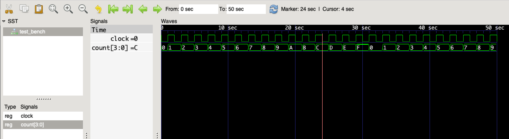

## Counter

**_"Information is change we can count." — Paul Borrill_**

At the heart of nearly all FPGA designs is the _counter_.
A counter tracks the number of occurences of an event.
A counter can measure the passage of time by counting clock pulses.
If we know the real-world frequency of the clock,
we can translate that into a known span of time.

### Our First Verilog Module

Verilog code is organized into _modules_.
We will start with a module named `test_bench`,
which has no parameters or contents (for now).

```verilog
module test_bench;

  // module contents go here...

endmodule
```

Comments starting with `//` extend to the end of the line.
Comments starting with `/*` extend until `*/`, possibly spanning multiple lines.

The first thing we need to do is create a "clock" signal,
so we have something to count.

```verilog
  // generate simulated chip clock
  reg clock = 0;
  always
    #1 clock = !clock;
```

Our `clock` is declared `reg`,
which means it is a "registered" 1-bit storage element.
This corresponds to a Flip-Flop (DFF) in the FPGA.
We give this element an initial value of `0`
(otherwise it would default to `X`, for _undefined_).

Next we create an `always` block,
which represents a continually repeating process.
Within the `always` block is a single statement,
a "blocking" assignment that inverts the `clock` value.
This assignment is prefixed with `#1`, a _delay_ of 1 time-unit.
The net effect is that the `clock` register toggles
between `0` and `1` each time-unit.

Now that we have a clock signal,
let's count the pulses.

```verilog
  // count positive-edge transitions of the clock
  reg [3:0] count = 0;  // free-running counter
  always @(posedge clock)
    count <= count + 1'b1;
```

Our `count` is declared as `reg`,
just like the `clock`,
but this time we specify a 4-bit storage element.
The `[3:0]` qualifier defines a group of 4 bits
with bit 3 (the MSB) on the left
and bit 0 (the LSB) on the right.
Again, we initialize the `count` to `0`.

Next we create an `always` block
with a _sensitivity list_ of `@(posedge clock)`.
This means that the body of the `always` block
will be executed each time that the `clock` transitions from `0` to `1`.
The body of a `always` block is a single statment,
a "non-blocking" assignment that adds `1` to the `count`.

There are a couple of important details to notice
in the statement that increments `count`.
First, we specify the increment as `1'b1`,
which is explictly a 1-bit binary value `1`.
This is because the default size for integer constants is 32 bits.
We don't want to generate a 32-bit adder circuit to add `1` to our 4-bit `count`.
Second, we are using the `<=` construct, for "non-blocking" assignment.
This is typical for assignments to `reg` variables in procedural blocks.
What it means is that the right-hand side is evaluated immediately
(using the current values of each variable),
but the assignement doesn't take effect until the next iteration of the block.
An easy way to think about this is that
`<=` uses the "current" values (particularly of storage elements)
to determine the value for the "next" update.
Usually, the clock signal is used to move data
from one stage to the next each iteration (synchronous logic).

Now that we have the basic logic in place,
we need to add a few directives to control the simulation.
This code does not affect the FPGA configuration.

```verilog
  // dump simulation signals
  initial
    begin
      $dumpfile("test_bench.vcd");
      $dumpvars(0, test_bench);
      #50;  // after 50 clock edges...
      $display("final count = %d", count);
      $finish;  // stop simulation
    end
```

We place our simulation controls in an `initial` block,
which is like `always`, except that it only executes once.
We use `begin` and `end` to include multiple statements in the `initial` block.
As with any procedural block, these statements execute sequentially.
We arrange to dump all of the variable values to the `test_bench.vcd` file.
The `#50;` statement is a delay of 50 time-units
with a null statement to execute.
The `$display` directive prints formatted information
to the console during simulation.
And finally, the `$finish` directive stops the simulation
so we can examine the results.

Here's the complete Verilog source for [`count_0.v`](count_0.v):

```verilog
// count_0.v -- stand-alone counter test

module test_bench;

  // dump simulation signals
  initial
    begin
      $dumpfile("test_bench.vcd");
      $dumpvars(0, test_bench);
      #50;  // after 50 clock edges...
      $display("final count = %d", count);
      $finish;  // stop simulation
    end

  // generate simulated chip clock
  reg clock = 0;
  always
    #1 clock = !clock;

  // count positive-edge transitions of the clock
  reg [3:0] count = 0;  // free-running counter
  always @(posedge clock)
    count <= count + 1'b1;

endmodule
```

We use Icarus Verilog to compile `count_0.v` into the executable program `test_bench.sim`.

```
$ iverilog -o test_bench.sim count_0.v
```

We can now run the simulation to generate console output and the trace file `test_bench.vcd`.

```
$ ./test_bench.sim
VCD info: dumpfile test_bench.vcd opened for output.
final count =  9
```

GTKWave gives us a visual display of `test_bench.vcd`.



_Note:_ You will have to select the `test_bench` module,
then drag the `clock` and `count` signals into the display list to see the traces.
