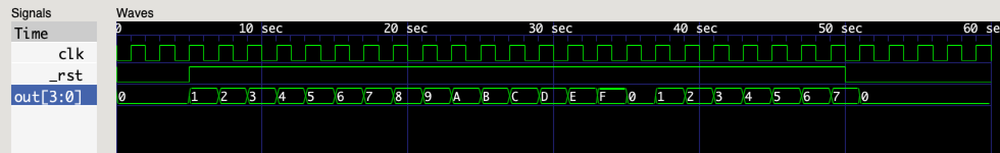

## Counter

**_"Time is change you can count." — Aristotle_**

At the heart of nearly all FPGA designs is the _counter_.
A counter tracks the number of occurences of an event.
A counter can measure the passage of time by counting clock pulses.
If we know the real-world frequency of the clock,
we can translate that into a known span of time.

### Our First Verilog Module

Verilog code is organized into _modules_.
We will start with a module named `test_bench`,
which has no parameters or contents (for now).

```verilog
module test_bench;

  // module contents go here...

endmodule
```

Comments starting with `//` extend to the end of the line.
Comments starting with `/*` extend until `*/`, possibly spanning multiple lines.

The first thing we need to do is create a "clock" signal,
so we have something to count.

```verilog
  // generate simulated chip clock
  reg clock = 0;
  always
    #1 clock = !clock;
```

Our `clock` is declared `reg`,
which means it is a "registered" 1-bit storage element.
This corresponds to a Flip-Flop (DFF) in the FPGA.
We give this element an initial value of `0`
(otherwise it would default to `X`, for _undefined_).

Next we create an `always` block,
which represents a continually repeating process.
Within the `always` block is a single statement,
a "blocking" assignment that inverts the `clock` value.
This assignment is prefixed with `#1`, a _delay_ of 1 time-unit.
The net effect is that the `clock` register toggles
between `0` and `1` each time-unit.

Now that we have a clock signal,
let's count the pulses.

```verilog
  // count positive-edge transitions of the clock
  reg [3:0] count = 0;  // free-running counter
  always @(posedge clock)
    count <= count + 1'b1;
```

Our `count` is declared as `reg`,
just like the `clock`,
but this time we specify a 4-bit storage element.
The `[3:0]` qualifier defines a group of 4 bits
with bit 3 (the MSB) on the left
and bit 0 (the LSB) on the right.
Again, we initialize the `count` to `0`.

Next we create an `always` block
with a _sensitivity list_ of `@(posedge clock)`.
This means that the body of the `always` block
will be executed each time that the `clock` transitions from `0` to `1`.
The body of a `always` block is a single statment,
a "non-blocking" assignment that adds `1` to the `count`.

There are a couple of important details to notice
in the statement that increments `count`.
First, we specify the increment as `1'b1`,
which is explictly a 1-bit binary value `1`.
This is because the default size for integer constants is 32 bits.
We don't want to generate a 32-bit adder circuit to add `1` to our 4-bit `count`.
Second, we are using the `<=` construct, for "non-blocking" assignment.
This is typical for assignments to `reg` variables in procedural blocks.
What it means is that the right-hand side is evaluated immediately
(using the current values of each variable),
but the assignement doesn't take effect until the next iteration of the block.
An easy way to think about this is that
`<=` uses the "current" values (particularly of storage elements)
to determine the value for the "next" update.
Usually, the clock signal is used to move data
from one stage to the next each iteration (synchronous logic).

Now that we have the basic logic in place,
we need to add a few directives to control the simulation.
This code does not affect the FPGA configuration.

```verilog
  // dump simulation signals
  initial
    begin
      $dumpfile("test_bench.vcd");
      $dumpvars(0, test_bench);
      #50;  // after 50 clock edges...
      $display("final count = %d", count);
      $finish;  // stop simulation
    end
```

We place our simulation controls in an `initial` block,
which is like `always`, except that it only executes once.
We use `begin` and `end` to include multiple statements in the `initial` block.
As with any procedural block, these statements execute sequentially.
We arrange to dump all of the variable values to the `test_bench.vcd` file.
The `#50;` statement is a delay of 50 time-units
with a null statement to execute.
The `$display` directive prints formatted information
to the console during simulation.
And finally, the `$finish` directive stops the simulation
so we can examine the results.

Here's the complete Verilog source for [`count_0.v`](count_0.v):

```verilog
// count_0.v -- stand-alone counter test

module test_bench;

  // dump simulation signals
  initial
    begin
      $dumpfile("test_bench.vcd");
      $dumpvars(0, test_bench);
      #50;  // after 50 clock edges...
      $display("final count = %d", count);
      $finish;  // stop simulation
    end

  // generate simulated chip clock
  reg clock = 0;
  always
    #1 clock = !clock;

  // count positive-edge transitions of the clock
  reg [3:0] count = 0;  // free-running counter
  always @(posedge clock)
    count <= count + 1'b1;

endmodule
```

We use Icarus Verilog to compile `count_0.v` into the executable program `test_bench.sim`.

```
$ iverilog -o test_bench.sim count_0.v
```

We can now run the simulation to generate console output and the trace file `test_bench.vcd`.

```
$ ./test_bench.sim
VCD info: dumpfile test_bench.vcd opened for output.
final count =  9
```

GTKWave gives us a visual display of `test_bench.vcd`.


_Note:_ You will have to select the `test_bench` module,
then drag the `clock` and `count` signals into the display list to see the traces.

### Module Instantiation

As our designs get more complex,
we will want to break them into
more managable (and potentially re-usable) pieces.
Although this design is still quite simple,
we can clearly separate the _counter_ logic
from the _test bench_ that drives it.
This will be a common pattern,
where a device-under-test (DUT)
is embedded in a fixture
to exercise its functionality.
The following block diagram
illustrates the organizational-structure
we are trying to achieve.

```
+------------------------------------+
| test_bench                         |
|                                    |
|         DUT                        |
|         +--------------+           |
|         | count        |           |
|         |              |  4        |
| clk --->|clock    count|--/--> out |
|         |              |           |
|         +--------------+           |
|                                    |
+------------------------------------+
```

We begin by extracting the counting logic into a [new module](count_1.v) called `count`.

```verilog
// count_1.v
//
// free-running counter
//

module count (
  input  wire      clock,       // system clock
  output reg [3:0] count = 0    // free-running counter
);

  // count positive-edge transitions of the clock
  always @(posedge clock)
    count <= count + 1'b1;

endmodule
```

The code is unchanged.
We've just wrapped it in a module
and specified its _input_ and _output_ ports.
The output port type is `reg`,
meaning that it provides storage for the `count`.
The input port type is `wire`,
meaning that it is simply a connection
to an externally-driven signal.

Now let's modify our [test bench](count_1_tb.v)
to create an instance of our new module.

```verilog
// count_1_tb.v
//
// simulation test bench for count_1.v
//

module test_bench;

  // dump simulation signals
  initial
    begin
      $dumpfile("test_bench.vcd");
      $dumpvars(0, test_bench);
      #50;  // after 50 clock edges...
      $display("final count = %d", out);
      $finish;  // stop simulation
    end

  // generate simulated chip clock
  reg clk = 0;
  always
    #1 clk = !clk;

  // instantiate device-under-test (DUT)
  wire [3:0] out;
  count DUT (
    .clock(clk),
    .count(out)
  );

endmodule
```

The simulation control and clock code are essentially unchanged.
The `count` module is instantiated with the name `DUT`.
The `clock` and `count` ports of the `count` module
are connected to the `clk` and `out` signals of the `test_bench`.
Notice which variables are `reg` (meaning they provide storage)
versus `wire` (meaning they are just connections).

We must compile both modules together to create a simulation.

```
$ iverilog -o test_bench.sim count_1.v count_1_tb.v
$ ./test_bench.sim
VCD info: dumpfile test_bench.vcd opened for output.
final count =  9
```

You can use GTKWave to visualize the combined traces, if you wish.

### Parameterized Modules

Module parameters makes modules easier to re-use.
They allow a module to be parameterized differently
each time it is instantiated.
In our case,
it would be useful to make
the bit-width of the counter
and the starting value
into instance parameters.

```verilog
// count_2.v
//
// free-running counter
//

module count #(
  parameter INIT = 0,                   // initial value
  parameter WIDTH = 16                  // counter bit-width
) (
  input                  _reset,        // active-low reset
  input                  clock,         // system clock
  output reg [WIDTH-1:0] count = INIT   // free-running counter
);

  // count positive-edge transitions of the clock
  always @(posedge clock)
    count <= _reset ? count + 1'b1 : INIT;

endmodule
```

The `INIT` and `WIDTH` parameters are given default values,
so you don't have to specify them unless you want to override the defaults.
Notice how the `WIDTH` parameter is used in the declaration of `count`.

We've also added a new feature to this module.
The `_reset` input can be used to hold the counter at the `INIT` value
until we're ready for it to start counting.
The conditional expression `_reset ? count + 1'b1 : INIT`
evaluates to the increment expression if `_reset` is `1`,
and the `INIT` value if `_reset` is `0` (active low logic).
This is equivalent to the following conditional:

```verilog
  always @(posedge clock)
    if (_reset)
      count <= count + 1'b1;
    else
      count <= INIT;
```

Once we've parameterized our `count` module,
we need to provide parameter values
for the instantiation in our test bench.

```verilog
// count_2_tb.v
//
// simulation test bench for count_2.v
//

module test_bench;

  // dump simulation signals
  initial
    begin
      $dumpfile("test_bench.vcd");
      $dumpvars(0, test_bench);
      #5 _rst = 1;  // come out of reset after 5 clock edges
      #45 _rst = 0;  // re-assert reset after 45 clock edges
      #10 $finish;  // stop simulation after 10 clock edges
    end

  // generate chip clock
  reg clk = 0;
  always
    #1 clk = !clk;

  // instantiate device-under-test
  localparam N = 4;
  wire [N-1:0] out;
  reg _rst = 0;
  count #(
    .WIDTH(N)
  ) DUT (
    ._reset(_rst),
    .clock(clk),
    .count(out)
  );

endmodule
```

We define `localparam N` to be the number of bits we want from the counter.
That way we can use `N` as both the value of the `WIDTH` parameter,
and in the declaration of `out`.
We also declare `reg _rst` with an initial value of `0` for our reset signal.
Since the reset is active-low,
this means the counter will be held in reset
until we raise this signal.

The simulation control script has been modified
to set and clear the reset signal.
Recall that the statements in a procedural block
are executed sequentially.
The optional delay prefix
defines the number of time-units to wait
before executing the statement.
This makes the delays cumulative,
so our script will take 60 time-units to complete.

Compile the new module definitions, and run the simulation to create the trace file.

```
$ iverilog -o test_bench.sim count_2.v count_2_tb.v
$ ./test_bench.sim
VCD info: dumpfile test_bench.vcd opened for output.
```

Use GTKWave to visualize the traces, including the new `_rst` signal.



### Conditional Compilation

[`count.v`](count.v):
```verilog
// count.v
//
// free-running counter
//

module count #(
  parameter INIT = 0,                   // initial value
  parameter WIDTH = 16                  // counter bit-width
) (
  input                  _reset,        // active-low reset
  input                  clock,         // system clock
  output                 msb,           // MSB of counter (pre-scaler)
  output reg [WIDTH-1:0] count = INIT   // free-running counter
);

  // count positive-edge transitions of the clock
  always @(posedge clock)
    count <= _reset ? count + 1'b1 : INIT;

  assign msb = count[WIDTH-1];

endmodule
```

[`count_tb.v`](count_tb.v):
```verilog
// count_tb.v
//
// simulation test bench for count.v
//

`define BREAK_OUT_BITS 1
`define TOGGLE_RESET 1

module test_bench;

  // dump simulation signals
  initial
    begin
      $dumpfile("test_bench.vcd");
      $dumpvars(0, test_bench);
`ifdef TOGGLE_RESET
      #5 _rst <= 1;  // come out of reset after 5 clock edges
      #85 _rst <= 0;  // re-assert reset after 85 clock edges
      #10 $finish;  // stop simulation after 10 clock edges
`else
      #100 $finish;  // stop simulation after 100 clock edges
`endif
    end

  // generate chip clock
  reg clk = 0;
  always
    #1 clk = !clk;

  // instantiate device-under-test
  localparam N = 4;
  wire [N-1:0] out;
`ifdef BREAK_OUT_BITS
  wire bit_0, bit_1, bit_2, bit_3;
`endif
`ifdef TOGGLE_RESET
  reg _rst = 0;
`endif
  count #(
    .WIDTH(N)
  ) DUT (
`ifdef TOGGLE_RESET
    ._reset(_rst),
`else
    ._reset(1'b1),
`endif
    .clock(clk),
    .count(out)
  );
`ifdef BREAK_OUT_BITS
  assign bit_0 = out[0];
  assign bit_1 = out[1];
  assign bit_2 = out[2];
  assign bit_3 = out[3];
`endif

endmodule
```
