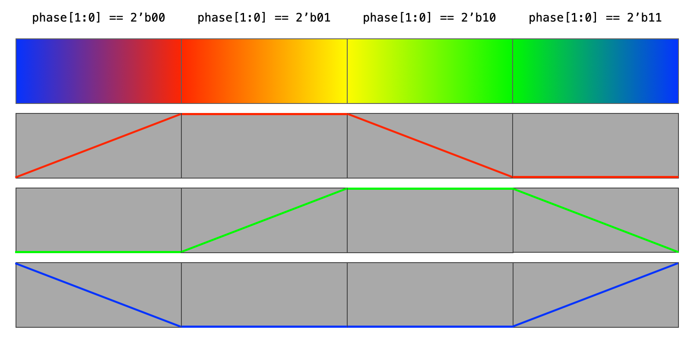

## Fomu Counter

The traditional ["Hello, World!"](https://en.wikipedia.org/wiki/%22Hello,_World!%22_program) program
for hardware is simply blinking an LED.
We can use our basic [Counter](README.md)
to control the RGB LED on the [Fomu](../fomu.md).
We will use the counter to divide the 48MHz system clock
down to human-perceptible blink frequencies.

| Count Bit | Frequency | Period | Clock Cycles |
|-----------|-----------|--------|--------------|
| `clk` | 48.000 MHz | 20.833... ns | 1 |
| 0 | 24.000 MHz | 41.666... ns | 2 |
| 1 | 12.000 MHz | 83.333... ns | 4 |
| 2 | 6.000 MHz | 166.66... ns | 8 |
| 3 | 3.000 MHz | 333.33... ns | 16 |
| 4 | 1.500 MHz | 666.66... ns | 32 |
| 5 | 750.00 kHz | 1.333... μs | 64 |
| 6 | 375.00 kHz | 2.666... μs | 128 |
| 7 | 187.50 kHz | 5.333... μs | 256 |
| 8 | 93.750 kHz | 10.666... μs | 512 |
| 9 | 46.875 kHz | 21.333... μs | 1,024 |
| 10 | 23.4375 kHz | 42.666... μs | 2,048 |
| 11 | 11.719 kHz | 85.333... μs | 4,096 |
| 12 | 5.859 kHz | 170.66... μs | 8,192 |
| 13 | 2.930 kHz | 341.33... μs | 16,384 |
| 14 | 1.465 kHz | 682.66... μs | 32,768 |
| 15 | 732.42 Hz | 1.3653... ms | 65,536 |
| 16 | 366.21 Hz | 2.7306... ms | 131,072 |
| 17 | 183.11 Hz | 5.4613... ms | 262,144 |
| 18 | 91.553 Hz | 10.9226... ms | 524,288 |
| 19 | 45.776 Hz | 21.8453... ms | 1,048,576 |
| 20 | 22.888 Hz | 43.6906... ms | 2,097,152 |
| 21 | 11.444 Hz | 87.3813... ms | 4,194,304 |
| 22 | 5.722 Hz | 174.7626... ms | 8,388,608 |
| 23 | 2.861 Hz | 349.5253... ms | 16,777,216 |
| 24 | 1.430 Hz | 699.0506... ms | 33,554,432 |
| 25 | 0.715 Hz | 1.398 s | 67,108,864 |
| 26 | 0.358 Hz | 2.796 s | 134,217,728 |
| 27 | 0.179 Hz | 5.592 s | 268,435,456 |
| 28 | 0.0894 Hz | 11.185 s | 536,870,912 |
| 29 | 0.0447 Hz | 22.370 s | 1,073,741,824 |
| 30 | 0.0234 Hz | 44.739 s | 2,147,483,648 |
| 31 | 0.0112 Hz | 89.478 s | 4,294,967,296 |

Remember that each clock-cycle includes both
a rising and falling edge,
so with a 48MHz clock
each simulation time-step represents
10.4166... nanoseconds (ns).

On the Fomu,
we will use _counter_ bits in the 25-27 range
to get blink periods measured in seconds.
We instatiate three components;
our (counter)[count_3.v],
a global signal driver (`SB_GB`),
and the RGB LED driver (`SB_RGBA_DRV`).
The [hard blocks](https://en.wikipedia.org/wiki/Logic_block)
`SB_GB` and `SB_RGBA_DRV` are predefined for the Fomu platform.
The following block diagram illustrates our design.

```
  +-------------------------------------------------------------------------+
  | fomu_pvt                                                                |
  |                                                          0 --> usb_dp_pu|--
  |                                                          0 -----> usb_dp|--
  |                                                          0 -----> usb_dn|--
  |                                                                         |
  |       clk_gb                                    RGBA_DRIVER             |
  |       +------------------------------+          +---------------+       |
  |       | SB_GB                        |          | SB_RGBA_DRV   |       |
  |       |                              |          |               |       |
->|clki ->|USER_SIGNAL_TO_GLOBAL_BUFFER  |     1 -->|CURREN         |       |
  |       |                              |     1 -->|RGBLEDEN       |       |
  |       |          GLOBAL_BUFFER_OUTPUT|-+        |               |       |
  |       |                              | |   +--->|RGB0PWM    RGB0|-> rgb0|--
  |       +------------------------------+ |   |+-->|RGB1PWM    RGB1|-> rgb1|--
  |                                        |   ||+->|RGB2PWM    RGB2|-> rgb2|--
  |  +-----------------clk-----------------+   |||  |               |       |
  |  |                                         |||  +---------------+       |
  |  |       counter                           |||                          |
  |  |       +--------------+                  |||                          |
  |  |       | count        |                  |||                          |
  |  |       |              | 28     out       |||                          |
  |  |  1 -->|_reset   count|--/--+--[0]-x     |||                          |
  |  |       |              |     +-  :        |||                          |
  |  +------>|clock      msb|-x   +--[25]------+|| LED_g                    |
  |          |              |     +--[26]-------+| LED_r                    |
  |          +--------------+     +--[27]--------+ LED_b                    |
  |                                                                         |
  +-------------------------------------------------------------------------+
```
Our top-level module
defines the Fomu platform
and instantiates the main components.
The `input`/`output` signals
represent external connections
(generally I/O pin pads).

```verilog
// count_3_fomu.v
//
// top-level module for Fomu PVT device (uses count_3.v)
//

`include "fomu_pvt.vh"

module fomu_pvt (
  input  clki,      // 48MHz oscillator input
  output rgb0,      // RGB LED pin 0 (**DO NOT** drive directly)
  output rgb1,      // RGB LED pin 1 (**DO NOT** drive directly)
  output rgb2,      // RGB LED pin 2 (**DO NOT** drive directly)
  output usb_dp,    // USB D+
  output usb_dn,    // USB D-
  output usb_dp_pu  // USB D+ pull-up
);

...

endmodule
```

Available top-level signals
are defined in [`fomu_pvt.pcf`](../../Fomu/pcf/fomu-pvt.pcf).
Note that there are many aliases for the same pin-pads.

The Fomu draws power (5V) from the USB host port.
Since we are not implementing a USB device on the Fomu,
we drive the USB pins to `0`,
which prevents the host from trying to enumerate this device.

```verilog
  // Drive USB pins to 0 to disconnect Fomu from the host system.
  // Otherwise it would try to talk to us over USB,
  // which wouldn't work since we have no stack.
  assign usb_dp = 1'b0;
  assign usb_dn = 1'b0;
  assign usb_dp_pu = 1'b0;
```

The 48MHz system clock signal requires special treatment.
Since it must drive synchronization throughout the design,
we connect it to one of the global buffer hard-blocks.

```verilog
  // Connect to system clock (with buffering)
  wire clk;  // 48MHz system clock
  SB_GB clk_gb (
    .USER_SIGNAL_TO_GLOBAL_BUFFER(clki),
    .GLOBAL_BUFFER_OUTPUT(clk)
  );
```

The raw LED output signals also require special treatment.
The Fomu has a special LED driver hard-block
that can be configured to properly drive the LED pins.
We define `wire LED_r, LED_g, LED_b;` to be
our connections to the RGB LED driver.

```verilog
  // Instantiate iCE40 LED driver hard logic
  wire LED_r, LED_g, LED_b;
  SB_RGBA_DRV #(
    .CURRENT_MODE(`RGBA_CURRENT_MODE_HALF),
//    .RGB0_CURRENT(`RGBA_CURRENT_08mA_04mA),
    .RGB0_CURRENT(`RGBA_CURRENT_16mA_08mA),  // green needs more current
    .RGB1_CURRENT(`RGBA_CURRENT_08mA_04mA),
    .RGB2_CURRENT(`RGBA_CURRENT_08mA_04mA)
  ) RGBA_DRIVER (
    .CURREN(1'b1),
    .RGBLEDEN(1'b1),
    .`REDPWM(LED_r),    // Red
    .`GREENPWM(LED_g),  // Green
    .`BLUEPWM(LED_b),   // Blue
    .RGB0(rgb0),
    .RGB1(rgb1),
    .RGB2(rgb2)
  );
```

We've collected the symbolic constant definitions (used above)
into a [header file](fomu_pvt.h) for convenient re-use.

```verilog
// fomu_pvt.vh

// Correctly map pins for the iCE40UP5K SB_RGBA_DRV hard macro.
`define GREENPWM RGB0PWM
`define REDPWM   RGB1PWM
`define BLUEPWM  RGB2PWM

// Parameters from iCE40 UltraPlus LED Driver Usage Guide, pages 19-20
`define RGBA_CURRENT_MODE_FULL "0b0"
`define RGBA_CURRENT_MODE_HALF "0b1"
// Current levels in Full / Half mode
`define RGBA_CURRENT_04mA_02mA "0b000001"
`define RGBA_CURRENT_08mA_04mA "0b000011"
`define RGBA_CURRENT_12mA_06mA "0b000111"
`define RGBA_CURRENT_16mA_08mA "0b001111"
`define RGBA_CURRENT_20mA_10mA "0b011111"
`define RGBA_CURRENT_24mA_12mA "0b111111"
```

We instantiate a 28-bit counter (from [`count_3.v`](count_3.v))
and expose the count bits as `out`.

```verilog
  // Instantiate counter
  localparam N = 28;
  wire [N-1:0] out;
  count #(
    .WIDTH(N)
  ) counter (
    ._reset(1'b1),
    .clock(clk),
    .count(out)
  );
```

We connect bits 25-27 to our LED control lines
through continuous assignment.

```verilog
  // Connect counter bits to LED
  assign LED_r = out[N-2];  // bit 26 ( ~2.8s cycle, ~1.4s on/off)
  assign LED_g = out[N-3];  // bit 25 ( ~1.4s cycle, ~0.7s on/off)
  assign LED_b = out[N-1];  // bit 27 ( ~5.6s cycle, ~2.8s on/off)
```

Now that our module is complete,
we have to generate a bitstream
to configure the FPGA on the Fomu device.

Synthesis, Place and Route, Package, and Deploy.

```
$ yosys -p 'synth_ice40 -json count_3_fomu.json' count_3.v count_3_fomu.v >count_3_fomu.log
$ nextpnr-ice40 --up5k --package uwg30 --pcf ../../Fomu/pcf/fomu-pvt.pcf --json count_3_fomu.json --asc count_3_fomu.asc
$ icepack count_3_fomu.asc count_3_fomu.bit
$ cp count_3_fomu.bit count_3_fomu.dfu
$ dfu-suffix -v 1209 -p 70b1 -a count_3_fomu.dfu
$ dfu-util -D count_3_fomu.dfu
```

When this program is downloaded to the Fomu,
it should start cycling through colors,
changing color every 0.7 seconds.

### Using Individual Bits

One common use of a counter
is to "pre-scale" the clock signal
to a lower frequency.
Each bit of the counter
divides the frequency in half.
For example,
if our system clock was 48MHz
(as it is on the [Fomu](../fomu.md))
and we set the counter `WIDTH` to `4`,
the most-significant bit (MSB) of the `count`
would toggle at a frequency of 3MHz.

```verilog
// count_3.v
//
// free-running counter
//

module count #(
  parameter INIT = 0,                   // initial value
  parameter WIDTH = 16                  // counter bit-width
) (
  input                  _reset,        // active-low reset
  input                  clock,         // system clock
  output                 msb,           // MSB of counter (pre-scaler)
  output reg [WIDTH-1:0] count = INIT   // free-running counter
);

  // count positive-edge transitions of the clock
  always @(posedge clock)
    count <= _reset ? count + 1'b1 : INIT;

  assign msb = count[WIDTH-1];

endmodule
```

Synthesis, Place and Route, Package, and Deploy.

```
$ yosys -p 'synth_ice40 -json pwm_0_fomu.json' count_3.v pwm_0.v pwm_0_fomu.v >pwm_0_fomu.log
$ nextpnr-ice40 --up5k --package uwg30 --pcf ../../Fomu/pcf/fomu-pvt.pcf --json pwm_0_fomu.json --asc pwm_0_fomu.asc
$ icepack pwm_0_fomu.asc pwm_0_fomu.bit
$ cp pwm_0_fomu.bit pwm_0_fomu.dfu
$ dfu-suffix -v 1209 -p 70b1 -a pwm_0_fomu.dfu
$ dfu-util -D pwm_0_fomu.dfu
```

We vary the PWM in 4 phases to create a gradually-changing rainbow effect.




```
$ nextpnr-ice40 --up5k --package uwg30 --pcf ../../Fomu/pcf/fomu-pvt.pcf --json count_3_fomu.json --asc count_3_fomu.asc
...
Info: Device utilisation:
Info:            ICESTORM_LC:    31/ 5280     0%
Info:           ICESTORM_RAM:     0/   30     0%
Info:                  SB_IO:     4/   96     4%
Info:                  SB_GB:     1/    8    12%
Info:           ICESTORM_PLL:     0/    1     0%
Info:            SB_WARMBOOT:     0/    1     0%
Info:           ICESTORM_DSP:     0/    8     0%
Info:         ICESTORM_HFOSC:     0/    1     0%
Info:         ICESTORM_LFOSC:     0/    1     0%
Info:                 SB_I2C:     0/    2     0%
Info:                 SB_SPI:     0/    2     0%
Info:                 IO_I3C:     0/    2     0%
Info:            SB_LEDDA_IP:     0/    1     0%
Info:            SB_RGBA_DRV:     1/    1   100%
Info:         ICESTORM_SPRAM:     0/    4     0%
...
Info: Max frequency for clock 'clk': 70.39 MHz (PASS at 12.00 MHz)
...
```

```
$ nextpnr-ice40 --up5k --package uwg30 --pcf ../../Fomu/pcf/fomu-pvt.pcf --json pwm_0_fomu.json --asc pwm_0_fomu.asc
...
Info: Device utilisation:
Info:            ICESTORM_LC:    49/ 5280     0%
Info:           ICESTORM_RAM:     0/   30     0%
Info:                  SB_IO:     4/   96     4%
Info:                  SB_GB:     1/    8    12%
Info:           ICESTORM_PLL:     0/    1     0%
Info:            SB_WARMBOOT:     0/    1     0%
Info:           ICESTORM_DSP:     0/    8     0%
Info:         ICESTORM_HFOSC:     0/    1     0%
Info:         ICESTORM_LFOSC:     0/    1     0%
Info:                 SB_I2C:     0/    2     0%
Info:                 SB_SPI:     0/    2     0%
Info:                 IO_I3C:     0/    2     0%
Info:            SB_LEDDA_IP:     0/    1     0%
Info:            SB_RGBA_DRV:     1/    1   100%
Info:         ICESTORM_SPRAM:     0/    4     0%
...
Info: Max frequency for clock 'clk': 70.39 MHz (PASS at 12.00 MHz)
...
```

```
$ nextpnr-ice40 --up5k --package uwg30 --pcf ../../Fomu/pcf/fomu-pvt.pcf --json pwm_1_fomu.json --asc pwm_1_fomu.asc
...
Info: Device utilisation:
Info:            ICESTORM_LC:   111/ 5280     2%
Info:           ICESTORM_RAM:     0/   30     0%
Info:                  SB_IO:     4/   96     4%
Info:                  SB_GB:     1/    8    12%
Info:           ICESTORM_PLL:     0/    1     0%
Info:            SB_WARMBOOT:     0/    1     0%
Info:           ICESTORM_DSP:     0/    8     0%
Info:         ICESTORM_HFOSC:     0/    1     0%
Info:         ICESTORM_LFOSC:     0/    1     0%
Info:                 SB_I2C:     0/    2     0%
Info:                 SB_SPI:     0/    2     0%
Info:                 IO_I3C:     0/    2     0%
Info:            SB_LEDDA_IP:     0/    1     0%
Info:            SB_RGBA_DRV:     1/    1   100%
Info:         ICESTORM_SPRAM:     0/    4     0%
...
Info: Max frequency for clock 'clk': 69.04 MHz (PASS at 12.00 MHz)
...
```

([_Back to FOMU Projects_](../fomu.md))
