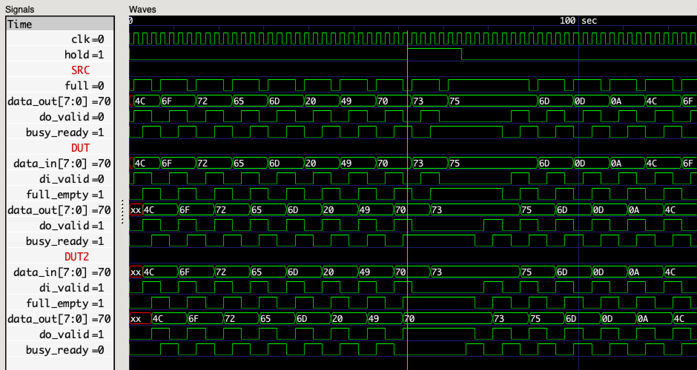

## FIFO Buffering

### **WARNING: THIS TUTORIAL IS UNDER CONSTRUCTION**

### Resources

 * [Wishbone Wikipedia Page](https://en.wikipedia.org/wiki/Wishbone_(computer_bus))
 * [Wishbone B4 bus spec](https://cdn.opencores.org/downloads/wbspec_b4.pdf)

### Synchronous Lock-Step Buffer

This buffer implementation uses
a synchronous interface protocol
with registered signals
that proceeds in lock-step
at both endpoints.
Components implementing this interface
can be connected point-to-point
in a dataflow chain.

```
       +----------------------------+
       | buffer                     |
       |                            |
------>|clk                         |
   Nd  |                            |   Nd
---/-->|data_in             data_out|---/-->
       |                            |
------>|di_valid            do_valid|------>
       |                            |
<------|full/_empty      busy/_ready|<------
       |                            |
       +----------------------------+
```

```
         ______
data  XXX______XXXXXXXXXX  `data` is only meaningful when `valid`, otherwise it can have any value
         ______
valid __/      \_________  `valid` may only be asserted when `!full`, and must remain asserted until `full`
            __________
full  _____/          \__  `full` may only be asserted when `valid`, and must remain asserted until `!valid'

```

```verilog
module buffer #(
  parameter              Nd = 8           // number of data bits
) (
  input                  clk,             // clock signal

  input         [Nd-1:0] data_in,         // input data
  input                  di_valid,        // input valid
  output                 full_empty,      // 1=full, 0=empty

  output        [Nd-1:0] data_out,        // output data
  output                 do_valid,        // output valid
  input                  busy_ready       // 1=busy, 0=ready
);

  reg full = 1'b0;
  reg [Nd-1:0] data;
  reg valid = 1'b0;
  wire busy = busy_ready;

  assign full_empty = full;
  assign data_out = data;
  assign do_valid = valid;

  // input interface
  always @(posedge clk)
    if (!full && di_valid)
      begin
        data <= data_in;
        full <= 1'b1;
        if (!busy)
          valid <= 1'b1;
      end

  // output interface
  always @(posedge clk)
    if (!busy && full)
      valid <= 1'b1;
    else if (busy && valid)
      begin
        valid <= 1'b0;
        full <= 1'b0;
      end

endmodule
```

Our test bench [lockstep_tb.v](lockstep_tb.v)
instantiates a data source [ls_source.v](ls_source.v)
and two data buffers [lockstep.v](lockstep.v).



Unfortunately,
when using a synchronous clock,
this protocol requires a full 4 clocks cycles
for each data transfer.
While this is very reliable,
we can do better.
One alternative is to use the
[Wishbone B4](https://cdn.opencores.org/downloads/wbspec_b4.pdf)
specification,
either in "Standard" or "Pipelined" mode.

### Exercises

 1. Implement Wishbone Standard mode
 2. Implement Wishbone Pipelined mode
 3. Implement multi-element FIFO

### Next Steps

 * [Fomu FIFO](fomu_pvt.md) (_coming soon_)
 * [TinyFPGA-BX FIFO](tinyfpga-bx.md) (_coming soon_)
 * ([_Back to Simulation_](../simulation.md#projects))
