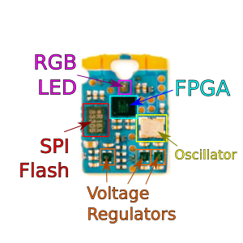

## Fomu platform

The [Fomu](https://tomu.im/fomu.html) is a programmable FPGA device that fits inside a USB port.
It has I/O contacts, an RGB LED, and an FPGA
that is compatible with a fully open source toolchain
and capable of running a RISC-V core.
Fomu comes with a custom plastic enclosure that slots perfectly into a USB Type-A port.

Development was [crowd-source funded](https://www.crowdsupply.com/sutajio-kosagi/fomu) in 2019.
A [Fomu Workshop](https://github.com/im-tomu/fomu-workshop)
is [published online](https://workshop.fomu.im/en/latest/).

This tutorial uses the Fomu as a deployment target
to demonstrate FPGA design on real hardware.

### Projects

 1. [Counter](counter/fomu_pvt.md)
 2. [Serial UART](uart/fomu_pvt.md) (_coming soon_)
 3. [Tone Generator](tone/fomu_pvt.md) (_coming soon_)

([_Back to Index_](README.md))
