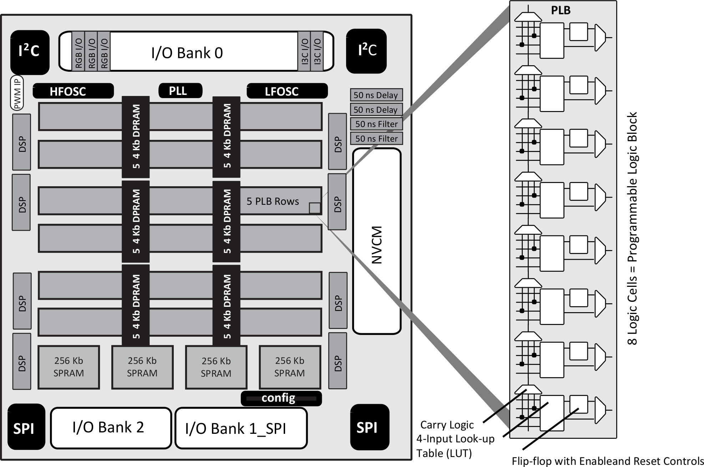

## Introduction

In this tutorial we will be using
the Verilog hardware description language (HDL)
to describe designs for FPGAs.

We will begin by using [Simulation](simulation.md)
to develop designs without requiring any FPGA hardware.

As we explore each design,
we will provide instructions
for deploying them to real hardware
on the [Fomu](fomu.md) and [TinyFPGA-BX](tinyfpga-bx.md) platforms.

Additional [Resources](resources.md) are also available for further exploration.

### What is an FPGA?

A Field-Programmable Gate Array (FPGA) is a hardware device
that can be configured to implement an arbitrary digital circuit.
A bit-stream (often read from persistent storage)
specifies the functions and connections which define the digital logic.

The basic building block of a typical FPGA is the _Logic Cell_.


A Logic Cell (LC) consists of
 * A Functional Look-Up Table (LUT)
 * A Storage Flip-Flop (DFF)
 * Control Logic (clock, etc.)
 * An optional Carry-Chain

The LUT can define any binary function from 4 inputs to 1 output.
The DFF can store a binary value, moving it between LCs based on Control Logic signals.
The Carry-Chain provides a fast-path interconnect between adjacent LCs.

The LCs are grouped together into _Programmable Logic Blocks_ (PLBs).
The PLBs are further configured by defining their _routing_ and _interconnect_.
The FPGA program bit-stream specifies how PLB signals are routed and connected
throughout the rest of the chip.

Ultimately, this routing and interconnect reaches the _hard blocks_ of the FPGA.
These define fixed functions of the chip,
such as I/O pin drivers, memory blocks, and a variety of special-purpose components.



The special-purpose hard blocks
vary considerably between different FPGA chips.
The diagram above describes the _iCE40UP5K_ FPGA,
a member of the [_iCE40 UltraPlus_ family](https://www.latticesemi.com/en/Products/FPGAandCPLD/iCE40UltraPlus)
from Lattice Semiconductor.
It includes
oscillators (for clock signals),
digital signal processors (DSPs),
communication protocol engines (SPI, I<sup>2</sup>C),
and non-volatile configuration memory (NVCM)
to store configuration bit-streams.

Fortunately, we don't have to specify the configuration bit-stream ourselves.
Instead, we use a _Hardware Description Language_ to describe the configuration we desire.

### What is Verilog?

[Verilog](https://en.wikipedia.org/wiki/Verilog) is a Hardware Description Language (HDL).
Verilog programs describe the functions and connections in an FPGA device
using higher-level semantic constructs,
similar to those used in a traditional programming language.
However, it's important to recognize that
hardware functions are concurrent,
not sequential like a traditional software program.

The following is an example of a complete Verilog module definition:
```verilog
// count.v
//
// free-running counter
//

module count #(
  parameter INIT = 0,                   // initial value
  parameter WIDTH = 16                  // counter bit-width
) (
  input                  _reset,        // active-low reset
  input                  clock,         // system clock
  output                 msb,           // MSB of counter (pre-scaler)
  output reg [WIDTH-1:0] count = INIT   // free-running counter
);

  // count positive-edge transitions of the clock
  always @(posedge clock)
    count <= _reset ? count + 1'b1 : INIT;

  assign msb = count[WIDTH-1];

endmodule
```

Continue on to the [Simulation](simulation.md) section
to explore this example in detail.

([_Back to Index_](README.md))
