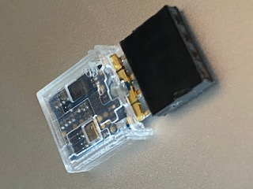
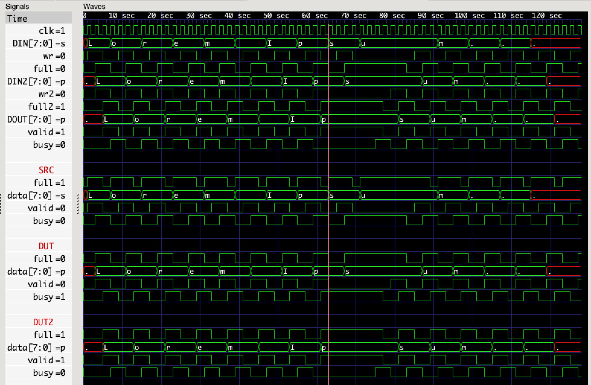

## Verilog Module Library

### **WARNING: THIS TUTORIAL IS UNDER CONSTRUCTION**

### Resources

 * [Orders of Magnitude — Frequency (Wikipedia)](https://en.wikipedia.org/wiki/Orders_of_magnitude_(frequency))
 * [Orders of Magnitude — Time (Wikipedia)](https://en.wikipedia.org/wiki/Orders_of_magnitude_(time))

### Minimizing Division Error

#### Fomu Clock Divisions

| N_DIV | Frequency   | Period        | Error  |
|-------|-------------|---------------|--------|
| 0     |  48.000 MHz |  20.833... ns |  0%    |
| 10    |  46.875 kHz |  21.333... μs |  0%    |
| 18    | 183.000  Hz |   5.46448  ms | -0.06% |

#### TinyFPGA-BX Clock Divisions

| N_DIV | Frequency   | Period        | Error  |
|-------|-------------|---------------|--------|
| 0     |  16.000 MHz |  62.500    ns |  0%    |
| 10    |  15.625 kHz |  64.000    μs |  0%    |
| 18    |  61.000  Hz |  16.39344  ms | -0.06% |

### Code

```verilog
module clk_div #(
  parameter              N_DIV = 8        // number of clock divisions
) (
  input                  clk_i,           // input clock (@ CLK_FREQ)
  output                 clk_o            // output clock (CLK_FREQ >> N_DIV)
);

  reg [N_DIV-1:0] div;  // clock divisions

  initial
    div = 1;

  always @(posedge clk_i)
    div[0] <= ~div[0];

  genvar i;
  generate
    for (i = 0; i < N_DIV-1; i = i+1)
      always @(posedge div[i])
        div[i+1] <= ~div[i+1];
  endgenerate

  assign clk_o = ~div[N_DIV-1];

endmodule
```



### Buffer Signals

```
       +----------------------------+
       | buffer                     |
       |                            |
------>|clk                         |
   Nd  |                            |   Nd
---/-->|data_in             data_out|---/-->
       |                            |
------>|di_valid            do_valid|------>
       |                            |
<------|full/_empty      busy/_ready|<------
       |                            |
       +----------------------------+
```

```verilog
module buffer #(
  parameter              Nd = 8           // number of data bits
) (
  input                  clk,             // clock signal

  input         [Nd-1:0] data_in,         // input data
  input                  di_valid,        // input valid
  output                 full_empty,      // 1=full, 0=empty

  output        [Nd-1:0] data_out,        // output data
  output                 do_valid,        // output valid
  input                  busy_ready       // 1=busy, 0=ready
);

  reg full = 1'b0;
  reg [Nd-1:0] data;
  reg valid = 1'b0;
  wire busy;

  always @(posedge clk)
    if (!full && di_valid)
      begin
        data <= data_in;
        full <= 1'b1;
      end

  assign full_empty = full;
  assign data_out = data;
  assign do_valid = valid;
  assign busy = busy_ready;

  always @(posedge clk)
    if (!busy && full)
      begin
        valid <= 1'b1;
        full <= 1'b0;
      end
    else
      valid <= 1'b0;

endmodule
```



### Exercises

 1. DFF Async Input Registration
 2. De-bounce Button Input
 3. Pulse stretcher driving LED (for debug)
 4. Embedded signal analyzer

### Next Steps

 * [Fomu Tone](fomu_pvt.md) (_coming soon_)
 * [TinyFPGA-BX Tone](tinyfpga-bx.md) (_coming soon_)
 * ([_Back to Simulation_](../simulation.md#projects))
