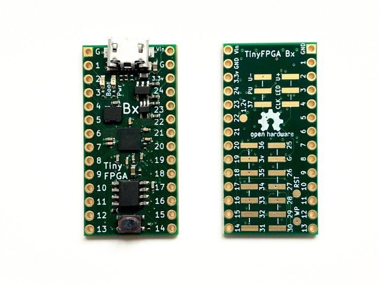

## TinyFPGA-BX platform

The [TinyFPGA boards](https://tinyfpga.com/) are a series
of low-cost, [open-source](https://github.com/tinyfpga) FPGA boards in a tiny form factor.
Solder on pins for use in a breadboard or PCB socket;
or solder connectors, wires, and components directly onto the board.

Development was [crowd-source funded](https://www.crowdsupply.com/tinyfpga/tinyfpga-ax-bx) in 2018.
The plaform is well-supported by a variety of open-source tools, including:
 * [IceStudio](https://github.com/FPGAwars/icestudio)
 * [Migen](https://m-labs.hk/migen/manual/introduction.html)
 * [Chisel](https://chisel.eecs.berkeley.edu/)
 * [APIO-IDE](https://github.com/FPGAwars/apio-ide/wiki)

The open-source [TinyFPGA Bootloader](https://github.com/tinyfpga/TinyFPGA-Bootloader)
implements a USB Serial device directly on the FPGA.

This tutorial uses the [TinyFPGA-BX](https://www.crowdsupply.com/tinyfpga/tinyfpga-ax-bx) board,
further described in this online [User Guide](https://tinyfpga.com/bx/guide.html)

### Projects

 1. [Counter](counter/tinyfpga-bx.md) (_coming soon_)
 2. [Tone Generator](tone/tinyfpga-bx.md) (_coming soon_)
 3. [Serial UART](uart/tinyfpga-bx.md) (_coming soon_)

([_Back to Index_](README.md))
