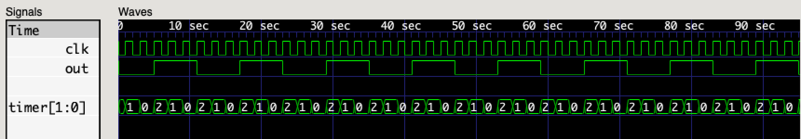

## Tone Generator

In this project we will explore
generating [_square-wave_](https://en.wikipedia.org/wiki/Square_wave) signals
with arbitrary [_frequencies_](https://en.wikipedia.org/wiki/Orders_of_magnitude_(frequency)).
In our [Counter Project](../counter/README.md)
we learned how to count clock pulses
and divide the clock frequency by powers-of-2.
However, in order to generate audible tones,
we must be able to generate arbitrary timing signals.
Rather than use a free-running counter,
we will create a count-down timer
and trigger our actions when the counter reaches zero.

### **WARNING: THIS TUTORIAL IS UNDER CONSTRUCTION**

### Resources

 * [Orders of Magnitude — Frequency (Wikipedia)](https://en.wikipedia.org/wiki/Orders_of_magnitude_(frequency))
 * [Orders of Magnitude — Time (Wikipedia)](https://en.wikipedia.org/wiki/Orders_of_magnitude_(time))
 * [Piano Key Frequencies (Wikipedia)](https://en.wikipedia.org/wiki/Piano_key_frequencies)
 * [MIDI](https://en.wikipedia.org/wiki/MIDI)
   * [What is MIDI?](https://www.instructables.com/What-is-MIDI/)
   * [Send and Receive MIDI With Arduino](https://www.instructables.com/Send-and-Receive-MIDI-with-Arduino/)
   * [Lab: MIDI Output using an Arduino](https://itp.nyu.edu/physcomp/labs/labs-serial-communication/lab-midi-output-using-an-arduino/)
   * [MIDI, an Overview](https://tigoe.github.io/SoundExamples/midi.html) (**RECOMMENDED**)

### Audible Tones

In this tutorial,
we will focus on [audible tones](https://en.wikipedia.org/wiki/Piano_key_frequencies).
The techniques we explore will be useful
whenever we need to precisely control signal frequencies
(e.g.: to implement [communication protocols](../uart/README.md)).
However,
we will apply these techniques
to audio synthesis
of frequencies spanning the following table:

| Note    | Frequency | Comments         |
|---------|-----------|------------------|
| C8      | 4186.009  | 88-key high note |
|    :    |     :     |    :             |
| B4      |  493.8833 | Ti               |
| A4      |  440.0000 | La (A440)        |
| G4      |  391.9954 | So               |
| F4      |  349.2282 | Fa               |
| E4      |  329.6276 | Mi               |
| D4      |  293.6648 | Re               |
| C4      |  261.6256 | Do (Middle C)    |
| B3      |  246.9417 |                  |
| A3      |  220.0000 |                  |
| G3      |  195.9977 |                  |
| F3      |  174.6141 |                  |
| E3      |  164.8138 |                  |
| D3      |  146.8324 |                  |
| C3      |  130.8128 |                  |
|    :    |     :     |    :             |
| A0      |   27.5000 | 88-key low note  |
|    :    |     :     |    :             |
| C0      |   16.3516 |                  |

We can generate a square-wave with arbitrary frequency
by counting positive edge transitions of our system clock.
Let's say our system clock is running at 48Hz.
This means the clock will have 48 positive edge transitions in 1 second.
If we want to generate an 8Hz square-wave output,
we must have 8 positive edge transitions per second.
We will also have 8 negative edge transitions between the positive edges,
for a total of 16 edge transitions per second.
So, if we're counting positive edges of the 48Hz system clock,
we want to toggle the output signal every 3 positive edges (48/16 = 3).

```verilog
// square.v
//
// square-wave generator
//

`default_nettype none

module tone_gen #(
  parameter CLK_FREQ = 48_000_000,      // clock frequency (Hz)
  parameter OUT_FREQ = 440              // output frequency (Hz)
) (
  input            clk,                 // input clock (@ CLK_FREQ)
  output           out                  // output signal (@ OUT_FREQ)
);
  localparam CNT = CLK_FREQ / (OUT_FREQ << 1);
  localparam INIT = CNT - 1;
  localparam N = $clog2(CNT);

  reg state = 0;
  reg [N-1:0] timer = INIT;
  always @(posedge clk)
    if (timer)
      timer <= timer - 1'b1;
    else
      begin
        timer <= INIT;
        state <= !state;
      end

  assign out = state;

endmodule
```

The `CNT` is the number of clock-cycles between output edge transitions,
which is the input frequency divided by twice the desired output frequency
(because we count both positive and negative output edges).
Since we're going to toggle the output when the counter reaches zero,
out `INIT` value is one less than `CNT`.
The number of bits `N` required for our `timer`
is the log-base-2 of the `CNT`.

We initialize the `timer` to the maximum value `INIT`.
On each positive edge of the `clk`,
if the `timer` is not zero,
we decrement the timer by one.
If the `timer` is zero,
we reset the `timer` to the `INIT` value,
and toggle the `state` of the output.

```verilog
// square_tb.v
//
// simulation test bench for square.v
//

`default_nettype none

module test_bench;

  localparam CLK_FREQ = 48;
  localparam OUT_FREQ = 8;

  // dump simulation signals
  initial
    begin
      $dumpfile("square.vcd");
      $dumpvars(0, test_bench);
      #(2 * CLK_FREQ);  // run for 1 simulated second
      $finish;  // stop simulation
    end

  // generate chip clock
  reg clk = 0;
  always
    #1 clk = !clk;

  // instantiate device-under-test
  wire out;
  tone_gen #(
    .CLK_FREQ(CLK_FREQ),
    .OUT_FREQ(OUT_FREQ)
  ) DUT (
    .clk(clk),
    .out(out)
  );

endmodule
```

Our test bench simply instantiates
the square-wave `tone_gen` module,
and drives the system clock for 1 simulated second.
After synthesis and simulation,
we can examine the generated traces.



### Code

```verilog
// pitch.vh
//
// musical tone definitions
//

`define Z  4'h0
`define B  4'h1
`define Bb 4'h2
`define A  4'h3
`define Ab 4'h4
`define G  4'h5
`define Gb 4'h6
`define F  4'h7
`define E  4'h8
`define Eb 4'h9
`define D  4'hA
`define Db 4'hB
`define C  4'hC
```

```verilog
// pitch.v
//
// musical tone generator
//

`default_nettype none

`include "pitch.vh"

module tone_gen #(
  parameter CLK_FREQ = 48_000_000
) (
  input            clk,                 // input clock (@ CLK_FREQ)
  input      [3:0] pitch,               // pitch index
  input      [2:0] octave,              // octave index
  output reg       tone = 0             // output tone (@ OUT_FREQ)
);

  // frequency table
  reg [21:0] freq_cnt [`Z:`C];  // count indexed by pitch
  initial
    begin
      freq_cnt[`Z] = 0;
      freq_cnt[`B] = CLK_FREQ / 30.86771;
      freq_cnt[`Bb] = CLK_FREQ / 29.13524;
      freq_cnt[`A] = CLK_FREQ / 27.50000;
      freq_cnt[`Ab] = CLK_FREQ / 25.95654;
      freq_cnt[`G] = CLK_FREQ / 24.49971;
      freq_cnt[`Gb] = CLK_FREQ / 23.12465;
      freq_cnt[`F] = CLK_FREQ / 21.82676;
      freq_cnt[`E] = CLK_FREQ / 20.60172;
      freq_cnt[`Eb] = CLK_FREQ / 19.44544;
      freq_cnt[`D] = CLK_FREQ / 18.35405;
      freq_cnt[`Db] = CLK_FREQ / 17.32391;
      freq_cnt[`C] = CLK_FREQ / 16.35160;

      $display("freq_cnt[%d] = %d", `Z, freq_cnt[`Z]);
      $display("freq_cnt[%d] = %d", `B, freq_cnt[`B]);
      $display("freq_cnt[%d] = %d", `Bb, freq_cnt[`Bb]);
      $display("freq_cnt[%d] = %d", `A, freq_cnt[`A]);
      $display("freq_cnt[%d] = %d", `Ab, freq_cnt[`Ab]);
      $display("freq_cnt[%d] = %d", `G, freq_cnt[`G]);
      $display("freq_cnt[%d] = %d", `Gb, freq_cnt[`Gb]);
      $display("freq_cnt[%d] = %d", `F, freq_cnt[`F]);
      $display("freq_cnt[%d] = %d", `E, freq_cnt[`E]);
      $display("freq_cnt[%d] = %d", `Eb, freq_cnt[`Eb]);
      $display("freq_cnt[%d] = %d", `D, freq_cnt[`D]);
      $display("freq_cnt[%d] = %d", `Db, freq_cnt[`Db]);
      $display("freq_cnt[%d] = %d", `C, freq_cnt[`C]);
    end

  reg [21:0] cnt = 0;  // count register

  always @(posedge clk)
    if (cnt)  // count down to zero
      cnt <= cnt - 1;
    else  // toggle output on zero
      if (pitch)
        begin
          tone <= !tone;
          cnt <= (freq_cnt[pitch] >> octave) - 1;
        end
      else  // rest
        begin
          tone <= 0;  // force 0 on rest
          cnt <= 0;
        end

endmodule
```

```verilog
// pitch_tb.v
//
// simulation test bench for pitch.v
//

`include "pitch.vh"

//`define CLK_FREQ = 48_000_000
//`define CLK_FREQ = 16_000_000
`define CLK_FREQ 16_000
//`define NOTE_DUR (`CLK_FREQ << 1)
`define NOTE_DUR (`CLK_FREQ >> 1)

`define WHL_NOTE (`NOTE_DUR >> 0)
`define HLF_NOTE (`NOTE_DUR >> 1)
`define QTR_NOTE (`NOTE_DUR >> 2)
`define ETH_NOTE (`NOTE_DUR >> 3)
`define SIX_NOTE (`NOTE_DUR >> 4)

`define NOTE_GAP (`NOTE_DUR >> 6)

module test_bench;

  // dump simulation signals
  initial
    begin
      $dumpfile("pitch.vcd");
      $dumpvars(0, test_bench);
      #(`NOTE_DUR * 3);  // run for a while
      $finish;  // stop simulation
    end

  // generate chip clock
  reg clk = 0;
  always
    #1 clk = !clk;

  // instantiate device-under-test
  reg [3:0] pitch = `Z;
  reg [2:0] octave = 0;
  wire out;
  tone_gen #(
    .CLK_FREQ(`CLK_FREQ)
  ) DUT (
    .clk(clk),
    .pitch(pitch),
    .octave(octave),
    .tone(out)
  );

  `define OP_PITCH (1'b0)
  `define OP_DELAY (1'b1)

  //  Close Encounters: D4 E4 C4 C3 G3
  reg [7:0] tune [0:15];  // 16x8-bit instructions
  initial
    begin
      $readmemh("pitch.hex", tune);
/*
      tune[4'h0] = { `OP_PITCH, 3'd4, `D };
      tune[4'h1] = { `OP_DELAY, 3'd0, 4'd2 };
      tune[4'h2] = { `OP_PITCH, 3'd4, `E };
      tune[4'h3] = { `OP_DELAY, 3'd0, 4'd3 };
      tune[4'h4] = { `OP_PITCH, 3'd4, `C };
      tune[4'h5] = { `OP_DELAY, 3'd0, 4'd3 };
      tune[4'h6] = { `OP_PITCH, 3'd3, `C };
      tune[4'h7] = { `OP_DELAY, 3'd0, 4'd2 };
      tune[4'h8] = { `OP_PITCH, 3'd3, `G };
      tune[4'h9] = { `OP_DELAY, 3'd0, 4'd2 };
      tune[4'hA] = { `OP_PITCH, 3'd0, `Z };
      tune[4'hB] = { `OP_DELAY, 3'd0, 4'd2 };
      tune[4'hC] = { `OP_PITCH, 3'd0, `Z };
      tune[4'hD] = { `OP_DELAY, 3'd0, 4'd2 };
      tune[4'hE] = { `OP_PITCH, 3'd0, `Z };
      tune[4'hF] = { `OP_DELAY, 3'd0, 4'd2 };
*/
//      $writememh("pitch2.hex", tune);
    end

  `define SEQ_EXEC (2'b00)
  `define SEQ_TONE (2'b01)
  `define SEQ_WAIT (2'b10)
  `define SEQ_HALT (2'b11)

  // sequencer state-machine
  reg [1:0] seq_state = `SEQ_EXEC;
  reg [3:0] seq_index = 0;  // index into tune[] data
  reg [26:0] seq_cnt = 0;  // delay timer
  wire [7:0] ins = tune[seq_index];  // current instruction
  always @(posedge clk)
    if (seq_cnt)  // count down to zero
      seq_cnt <= seq_cnt - 1'b1;
    else  // take action on zero
      case (seq_state)
        `SEQ_EXEC :  // execute instruction
          begin
            if (ins[7] == `OP_PITCH)
              begin
                pitch <= ins[3:0];
                octave <= ins[6:4];
              end
            else if (ins[7] == `OP_DELAY)
              begin
                seq_cnt <= (`WHL_NOTE >> ins[3:0]) - `NOTE_GAP;
                seq_state <= `SEQ_TONE;
              end
            seq_index <= seq_index + 1;  // move to next instruction (loop on zero)
          end
        `SEQ_TONE :  // play note for duration
          begin
            pitch <= `Z;
            octave <= 0;
            seq_cnt <= `NOTE_GAP;
            seq_state <= `SEQ_WAIT;
          end
        `SEQ_WAIT :  // wait between notes
          seq_state <= `SEQ_EXEC;
        default :  // halt
          seq_state <= `SEQ_HALT;
      endcase

endmodule
```

```verilog
// Close Encounters: D4(Red/Pink) E4(Orange) C4(Magenta/Purple) C3(Yellow) G3(White/Blue)
4a 82
48 82
4c 82
3c 82
35 82
00 82
00 82
00 82
```


### Exercises

 1. Implement dotted note durations (1.5x normal).
 2. Add support for looping note sequences.
 3. Add support for counted repeats.
 4. Implement tied notes (no gap between notes).

### Next Steps

 * [Fomu Tone](fomu_pvt.md) (_coming soon_)
 * [TinyFPGA-BX Tone](tinyfpga-bx.md) (_coming soon_)
 * [_Back to Simulation_](../simulation.md#projects)
