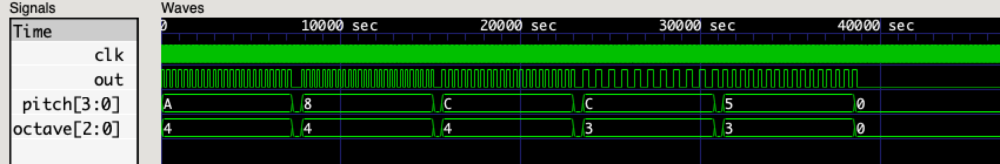

## Tone Generator

### **WARNING: THIS TUTORIAL IS NOT YET READY FOR REVIEW**

| Note    | Frequency | Comments      |
|---------|-----------|---------------|
| B8      | 7902.133  |               |
| B8      | 7902.133  |               |
| A#8/Bb8 | 7458.620  |               |
| A8      | 7040.000  |               |
| G#8/Ab8 | 6644.875  |               |
| G8      | 6271.927  |               |
| F#8/Gb8 | 5919.911  |               |
| F8      | 5587.652  |               |
| E8      | 5274.041  |               |
| D#8/Eb8 | 4978.032  |               |
| D8      | 4698.636  |               |
| C#8/Db8 | 4434.922  |               |
| C8      | 4186.009  | (88-key high) |
|    :    |     :     |    :          |
| B4      |  493.8833 | Ti            |
| A4      |  440.0000 | La (A440)     |
| G4      |  391.9954 | So            |
| F4      |  349.2282 | Fa            |
| E4      |  329.6276 | Mi            |
| D4      |  293.6648 | Re            |
| C4      |  261.6256 | Do (Middle C) |
| B3      |  246.9417 |               |
| A3      |  220.0000 |               |
| G3      |  195.9977 |               |
| F3      |  174.6141 |               |
| E3      |  164.8138 |               |
| D3      |  146.8324 |               |
| C3      |  130.8128 |               |
|    :    |     :     |    :          |
| A0      |   27.5000 | (88-key low)  |
|    :    |     :     |    :          |
| C0      |   16.3516 |               |


### Resources

 * [Orders of Magnitude — Frequency (Wikipedia)](https://en.wikipedia.org/wiki/Orders_of_magnitude_(frequency))
 * [Orders of Magnitude — Time (Wikipedia)](https://en.wikipedia.org/wiki/Orders_of_magnitude_(time))
 * [Piano Key Frequencies (Wikipedia)](https://en.wikipedia.org/wiki/Piano_key_frequencies)
 * [MIDI](https://en.wikipedia.org/wiki/MIDI)
   * [What is MIDI?](https://www.instructables.com/What-is-MIDI/)
   * [Send and Receive MIDI With Arduino](https://www.instructables.com/Send-and-Receive-MIDI-with-Arduino/)
   * [Lab: MIDI Output using an Arduino](https://itp.nyu.edu/physcomp/labs/labs-serial-communication/lab-midi-output-using-an-arduino/)
   * [MIDI, an Overview](https://tigoe.github.io/SoundExamples/midi.html) (**RECOMMENDED**)

### Code

```verilog
// pitch.vh
//
// musical tone definitions
//

`define Z  4'h0
`define B  4'h1
`define Bb 4'h2
`define A  4'h3
`define Ab 4'h4
`define G  4'h5
`define Gb 4'h6
`define F  4'h7
`define E  4'h8
`define Eb 4'h9
`define D  4'hA
`define Db 4'hB
`define C  4'hC
```

```verilog
// pitch.v
//
// musical tone generator
//

`include "pitch.vh"

module tone_gen #(
  parameter CLK_FREQ = 48_000_000
) (
  input       clk,                      // input clock (@ CLK_FREQ)
  input [3:0] pitch,                    // pitch index
  input [2:0] octave,                   // octave index
  output reg  tone = 0                  // output tone (@ OUT_FREQ)
);

  // frequency table
  reg [21:0] freq_cnt [`Z:`C];  // count indexed by pitch
  initial
    begin
      freq_cnt[`Z] = 0;
      $display("freq_cnt[%d] = %d", `Z, freq_cnt[`Z]);
      freq_cnt[`B] = CLK_FREQ / 30.86771;
      $display("freq_cnt[%d] = %d", `B, freq_cnt[`B]);
      freq_cnt[`Bb] = CLK_FREQ / 29.13524;
      $display("freq_cnt[%d] = %d", `Bb, freq_cnt[`Bb]);
      freq_cnt[`A] = CLK_FREQ / 27.50000;
      $display("freq_cnt[%d] = %d", `A, freq_cnt[`A]);
      freq_cnt[`Ab] = CLK_FREQ / 25.95654;
      $display("freq_cnt[%d] = %d", `Ab, freq_cnt[`Ab]);
      freq_cnt[`G] = CLK_FREQ / 24.49971;
      $display("freq_cnt[%d] = %d", `G, freq_cnt[`G]);
      freq_cnt[`Gb] = CLK_FREQ / 23.12465;
      $display("freq_cnt[%d] = %d", `Gb, freq_cnt[`Gb]);
      freq_cnt[`F] = CLK_FREQ / 21.82676;
      $display("freq_cnt[%d] = %d", `F, freq_cnt[`F]);
      freq_cnt[`E] = CLK_FREQ / 20.60172;
      $display("freq_cnt[%d] = %d", `E, freq_cnt[`E]);
      freq_cnt[`Eb] = CLK_FREQ / 19.44544;
      $display("freq_cnt[%d] = %d", `Eb, freq_cnt[`Eb]);
      freq_cnt[`D] = CLK_FREQ / 18.35405;
      $display("freq_cnt[%d] = %d", `D, freq_cnt[`D]);
      freq_cnt[`Db] = CLK_FREQ / 17.32391;
      $display("freq_cnt[%d] = %d", `Db, freq_cnt[`Db]);
      freq_cnt[`C] = CLK_FREQ / 16.35160;
      $display("freq_cnt[%d] = %d", `C, freq_cnt[`C]);
    end

  reg [21:0] cnt = 0;  // count register

  always @(posedge clk)
    if (cnt)  // count down to zero
      cnt <= cnt - 1;
    else  // toggle output on zero
      if (pitch)
        begin
          tone <= !tone;
          cnt <= (freq_cnt[pitch] >> (octave + 1)) - 1;
        end
      else  // rest
        begin
          tone <= 0;  // force 0 on rest
          cnt <= 0;
        end

endmodule
```

```verilog
// pitch_tb.v
//
// simulation test bench for pitch.v
//

`include "pitch.vh"

//`define CLK_FREQ = 48_000_000
//`define CLK_FREQ = 16_000_000
`define CLK_FREQ 16_000
//`define NOTE_DUR (`CLK_FREQ << 1)
`define NOTE_DUR (`CLK_FREQ >> 1)

`define WHL_NOTE (`NOTE_DUR >> 0)
`define HLF_NOTE (`NOTE_DUR >> 1)
`define QTR_NOTE (`NOTE_DUR >> 2)
`define ETH_NOTE (`NOTE_DUR >> 3)
`define SIX_NOTE (`NOTE_DUR >> 4)

`define NOTE_GAP (`NOTE_DUR >> 6)

module test_bench;

  // dump simulation signals
  initial
    begin
      $dumpfile("pitch.vcd");
      $dumpvars(0, test_bench);
      #(`NOTE_DUR * 3);  // run for a while
      $finish;  // stop simulation
    end

  // generate chip clock
  reg clk = 0;
  always
    #1 clk = !clk;

  // instantiate device-under-test
  reg [3:0] pitch = `Z;
  reg [2:0] octave = 0;
  wire out;
  tone_gen #(
    .CLK_FREQ(`CLK_FREQ)
  ) DUT (
    .clk(clk),
    .pitch(pitch),
    .octave(octave),
    .tone(out)
  );

  `define OP_PITCH (1'b0)
  `define OP_DELAY (1'b1)

  //  Close Encounters: D4 E4 C4 C3 G3
  reg [7:0] tune [0:15];  // 16x8-bit instructions
  initial
    begin
      $readmemh("pitch.hex", tune);
/*
      tune[4'h0] = { `OP_PITCH, 3'd4, `D };
      tune[4'h1] = { `OP_DELAY, 3'd0, 4'd2 };
      tune[4'h2] = { `OP_PITCH, 3'd4, `E };
      tune[4'h3] = { `OP_DELAY, 3'd0, 4'd3 };
      tune[4'h4] = { `OP_PITCH, 3'd4, `C };
      tune[4'h5] = { `OP_DELAY, 3'd0, 4'd3 };
      tune[4'h6] = { `OP_PITCH, 3'd3, `C };
      tune[4'h7] = { `OP_DELAY, 3'd0, 4'd2 };
      tune[4'h8] = { `OP_PITCH, 3'd3, `G };
      tune[4'h9] = { `OP_DELAY, 3'd0, 4'd2 };
      tune[4'hA] = { `OP_PITCH, 3'd0, `Z };
      tune[4'hB] = { `OP_DELAY, 3'd0, 4'd2 };
      tune[4'hC] = { `OP_PITCH, 3'd0, `Z };
      tune[4'hD] = { `OP_DELAY, 3'd0, 4'd2 };
      tune[4'hE] = { `OP_PITCH, 3'd0, `Z };
      tune[4'hF] = { `OP_DELAY, 3'd0, 4'd2 };
*/
//      $writememh("pitch2.hex", tune);
    end

  `define SEQ_EXEC (2'b00)
  `define SEQ_TONE (2'b01)
  `define SEQ_WAIT (2'b10)
  `define SEQ_HALT (2'b11)

  // sequencer state-machine
  reg [1:0] seq_state = `SEQ_EXEC;
  reg [3:0] seq_index = 0;  // index into tune[] data
  reg [26:0] seq_cnt = 0;  // delay timer
  wire [7:0] ins = tune[seq_index];  // current instruction
  always @(posedge clk)
    if (seq_cnt)  // count down to zero
      seq_cnt <= seq_cnt - 1;
    else  // take action on zero
      case (seq_state)
        `SEQ_EXEC :  // execute instruction
          begin
            if (ins[7] == `OP_PITCH)
              begin
                pitch <= ins[3:0];
                octave <= ins[6:4];
              end
            else if (ins[7] == `OP_DELAY)
              begin
                seq_cnt <= (`WHL_NOTE >> ins[3:0]) - `NOTE_GAP;
                seq_state <= `SEQ_TONE;
              end
            seq_index <= seq_index + 1;  // move to next instruction (loop on zero)
          end
        `SEQ_TONE :  // play note for duration
          begin
            pitch <= `Z;
            octave <= 0;
            seq_cnt <= `NOTE_GAP;
            seq_state <= `SEQ_WAIT;
          end
        `SEQ_WAIT :  // wait between notes
          seq_state <= `SEQ_EXEC;
        default :  // halt
          seq_state <= `SEQ_HALT;
      endcase

endmodule
```

```verilog
// Close Encounters: D4(Red/Pink) E4(Orange) C4(Magenta/Purple) C3(Yellow) G3(White/Blue)
4a 82
48 82
4c 82
3c 82
35 82
00 82
00 82
00 82
```



### Exercises

 1. Implement dotted note durations (1.5x normal).
 2. Add support for looping note sequences.
 3. Add support for counted repeats.
 4. Implement tied notes (no gap between notes).
