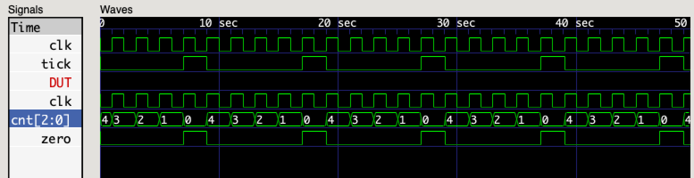

## Serial UART

In this project we will explore [Serial Communication](https://learn.sparkfun.com/tutorials/serial-communication)
by implementing a [Universal Asynchronous Receiver-Transmitter (UART)](https://en.wikipedia.org/wiki/Universal_asynchronous_receiver-transmitter).
In our [Counter Project](../counter/README.md)
we learned how to count clock pulses
and divide the clock frequency by powers-of-2.
However, in order to communicate via a _Serial UART_,
we must be able to generate arbitrary timing signals.

Rather than using a free-running counter,
we will create a count-down timer
and trigger our actions when the counter reaches zero.
Communication _baud rates_ are expressed in bits/second (BPS)
and clock frequencies are expressed in cycles/second (Hz).
So, the number of _clocks-per-bit_ is _clock-frequency_ divided by _bits-per-second_.
This tells us where to start our count-down timer
in order to generate a _bit-frequency_ signal each time the timer reaches zero.

```verilog
// baud_gen.v
//
// baud-rate generator
//

module baud_gen #(
  parameter CLK_FREQ = 48_000_000,      // clock frequency (Hz)
  parameter BIT_FREQ = 115_200          // baud rate (bits per second)
) (
  input            clk,                 // input clock
  output           zero                 // output tick
);
  localparam CNT = CLK_FREQ / BIT_FREQ;
  localparam N = $clog2(CNT);

  reg [N-1:0] cnt = (CNT - 1);
  always @(posedge clk)
    cnt <= zero ? (CNT - 1) : cnt - 1'b1;

  assign zero = !cnt;

endmodule
```

The `CLK_FREQ` and `BIT_FREQ` parameters make it easy to configure the baud-rate generator.
The default `CLK_FREQ` is 48Mhz, which is the frequency of the system clock on the [Fomu](../fomu.md).
The `localparam CNT` calculates the number of clock-cycles (positive edges) for 1 bit-time.
The `localparam N` uses the built-in `$clog2` function
to determine the number of bits needed
to hold the maximum count value.
The count-down value `cnt` runs from `(CNT - 1)` to `0`.
The `zero` signal is `1` if `cnt` is _not_ `0`.
We use the `zero` signal in a conditional expression
to decide if we should reset the counter to its maximum value
or just decrement the counter.

A simple _test bench_ exercises the `baud_gen` module
with very small values for `CLK_FREQ` and `BIT_FREQ`
so we don't generate a huge trace.

```verilog
// baud_gen_tb.v
//
// simulation test bench for baud_gen.v
//

module test_bench;

  // dump simulation signals
  initial
    begin
      $dumpfile("test_bench.vcd");
      $dumpvars(0, test_bench);
      #50;
      $finish;
    end

  // generate chip clock
  reg clk = 0;
  always
    #1 clk = !clk;

  // instantiate device-under-test
  wire tick;
  baud_gen #(
    .CLK_FREQ(16),
    .BIT_FREQ(3)
  ) DUT (
    .clk(clk),
    .zero(tick)
  );

endmodule
```

Compile the modules and run the simulation, as usual.

```
$ iverilog -o test_bench.sim baud_gen.v baud_gen_tb.v
$ ./test_bench.sim 
VCD info: dumpfile test_bench.vcd opened for output.
```

Examine the waveform traces with GTKWave.



_Note:_ Right-click on the `cnt[2:0]` signal and select **Data Format -> Decimal**.

### Links

 * [UART (Wikipedia)](https://en.wikipedia.org/wiki/Universal_asynchronous_receiver-transmitter)
 * [Serial Communication (sparkfun)](https://learn.sparkfun.com/tutorials/serial-communication)
 * [UART vs I2C vs SPI (Seeed Studio)](https://www.seeedstudio.com/blog/2019/09/25/uart-vs-i2c-vs-spi-communication-protocols-and-uses/)
 * [Metastability (Wikipedia)](https://en.wikipedia.org/wiki/Metastability_(electronics))
 * [Null Modem (Wikipedia)](https://en.wikipedia.org/wiki/Null_modem)

### Code

```verilog
// uart.v
//
// serial UART (8N1)
//

`define IDLE_BIT  1'b1
`define START_BIT 1'b0
`define STOP_BIT  1'b1

module uart #(
  parameter CLK_FREQ = 48_000_000,      // clock frequency (Hz)
  parameter BIT_FREQ = 115_200          // baud rate (bits per second)
) (
  input            clk,                 // input clock
  input            wr,                  // write signal
  input      [7:0] d_out,               // character to transmit
  input            rx,                  // receive data
  output reg [7:0] d_in,                // character received
  output           ready,               // receive ready
  output           busy,                // transmit busy
  output           tx                   // transmit data
);

  // transmit baud-rate generator
  localparam TX_CNT = CLK_FREQ / BIT_FREQ;
  localparam TX_N = $clog2(TX_CNT);
  reg [TX_N-1:0] tx_cnt;

  // transmitter state-machine
  reg [8:0] tx_shift;  // transmit shift-register
  localparam TX_IDLE = 4'b1111;
  reg [3:0] tx_state = TX_IDLE;  // state-machine enumeration
  always @(posedge clk)
    if (tx_state == TX_IDLE)  // transmitter idle
      begin
        if (wr)  // on "write"
          begin
            tx_shift <= { d_out, `START_BIT };  // load shift register
            tx_cnt <= TX_CNT - 1;   // reset counter
            tx_state <= 0;
          end
      end
    else if (tx_cnt)  // waiting...
      tx_cnt <= tx_cnt - 1'b1;
    else  // transmit data
      begin
        tx_shift <= { `STOP_BIT, tx_shift[8:1] };
        tx_cnt <= TX_CNT - 1;   // reset counter
        tx_state <= (tx_state == 9) ? TX_IDLE : tx_state + 1'b1;
      end
  assign tx = (tx_state == TX_IDLE) ? `IDLE_BIT : tx_shift[0];
  assign busy = (tx_state != TX_IDLE);

  // receive baud-rate generator
  localparam RX_CNT = CLK_FREQ / BIT_FREQ;
  localparam RX_N = $clog2(RX_CNT);
  reg [RX_N-1:0] rx_cnt;

  // register async rx
  reg [1:0] rx_shift;  // receive shift-register
  always @(posedge clk)
    rx_shift <= { rx_shift[0], rx };

  // receiver state-machine
  reg [3:0] rx_state = RX_IDLE;
  localparam RX_IDLE = 4'b1111;
  always @(posedge clk)
    if (rx_state == RX_IDLE)  // idle... watch for (negedge rx)
      begin
        if (rx_shift == 2'b00)  // start edge
          begin
            rx_cnt <= (RX_CNT >> 1) - 1;  // count to midpoint
            rx_state = 0;
          end
      end
    else if (rx_state == 10)  // ready (for one cycle)
      begin
        rx_state <= RX_IDLE;
      end
    else if (rx_cnt)  // waiting...
      rx_cnt <= rx_cnt - 1'b1;
    else if (rx_state == 0)  // start bit
      begin
        d_in <= 8'h00;  // clear receive data
        rx_cnt <= RX_CNT - 1;  // reset counter
        rx_state <= (rx_shift == 2'b00) ? 1 : 9;
      end
    else if (rx_state == 9)  // stop bit
      begin
        rx_cnt <= (RX_CNT >> 1) - 1;  // count to midpoint
        rx_state <= (rx_shift == 2'b11) ? 10 : 9;
      end
    else  // receive data
      begin
        d_in <= { rx_shift[1], d_in[7:1] };
        rx_cnt <= RX_CNT - 1;  // reset counter
        rx_state <= rx_state + 1'b1;
      end
  assign ready = (rx_state == 10);

endmodule
```

```verilog
// uart_tb.v
//
// simulation test bench for uart.v/uart_8n1.v
//

`define SIM_RATE 24

module test_bench;

  // bit-clock frequency
//  parameter BAUD_RATE = 115_200;
  parameter BAUD_RATE = 2_000_000;  // 2Mhz bit-clock for simulation only

  // dump simulation signals
  initial
    begin
      $dumpfile("test_bench.vcd");
      $dumpvars(0, test_bench);
      #(`SIM_RATE * 3) DTR <= 1;  // set data-terminal-ready
      #(`SIM_RATE * 1) DTR <= 0;  // clear data-terminal-ready
      #(`SIM_RATE * 24) DTR <= 1;  // set data-terminal-ready
      #(`SIM_RATE * 22) DTR <= 0;  // clear data-terminal-ready
      #(`SIM_RATE * 4) DTR <= 1;  // set data-terminal-ready
      #(`SIM_RATE * 12) DTR <= 0;  // clear data-terminal-ready
      #(`SIM_RATE * 8) $finish;  // stop simulation
    end

  // generate chip clock
  reg clk = 0;
  always
    #1 clk = !clk;

  // instantiate device-under-test
  reg DTR = 0;  // data terminal ready
  wire RX;  // receive data
  wire RDY;  // receive ready
  wire TX;  // transmit data
  wire BSY;  // transmit busy
  wire [7:0] DATA;  // received data
  uart #(
    .BIT_FREQ(BAUD_RATE)
  ) DUT (
    .clk(clk),
    .wr(DTR),
    .d_out("K"),
    .rx(RX),
    .d_in(DATA),
    .ready(RDY),
    .busy(BSY),
    .tx(TX)
  );

  // loopback TX -> RX
  reg loopback = 1;  // idle line
  always @(posedge clk)
    loopback <= TX;
  assign RX = loopback;

endmodule
```
