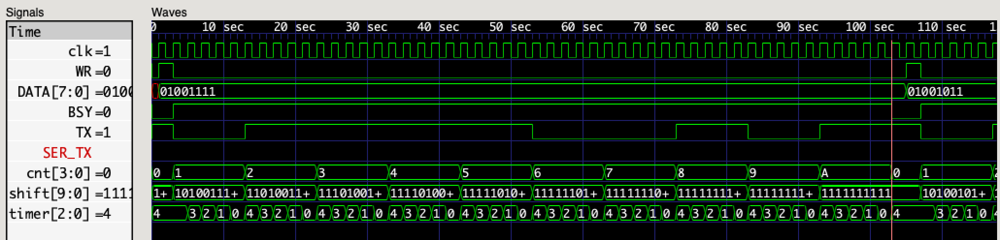

## Serial UART

In this project we will explore [Serial Communication](https://learn.sparkfun.com/tutorials/serial-communication)
by implementing a [Universal Asynchronous Receiver-Transmitter (UART)](https://en.wikipedia.org/wiki/Universal_asynchronous_receiver-transmitter).
In our [Counter Project](../counter/README.md)
we learned how to count clock pulses
and divide the clock frequency by powers-of-2.
However, in order to communicate via a _Serial UART_,
we must be able to generate arbitrary timing signals.
Rather than use a free-running counter,
we will create a count-down timer
and trigger our actions when the counter reaches zero.

### Baud-Rate Generator

Communication _baud rates_ are expressed in bits/second (BPS)
and clock frequencies are expressed in cycles/second (Hz).
So, the number of _clocks-per-bit_ is the _clock-frequency_ divided by _bits-per-second_.
This tells us where to start our count-down timer
in order to generate a _bit-frequency_ signal each time the timer reaches zero.

```verilog
// baud_gen.v
//
// baud-rate generator
//

module baud_gen #(
  parameter CLK_FREQ = 48_000_000,      // clock frequency (Hz)
  parameter BIT_FREQ = 115_200          // baud rate (bits per second)
) (
  input            clk,                 // input clock
  output           zero                 // output tick
);
  localparam CNT = CLK_FREQ / BIT_FREQ;
  localparam N = $clog2(CNT);

  reg [N-1:0] cnt = (CNT - 1);
  always @(posedge clk)
    cnt <= zero ? (CNT - 1) : cnt - 1'b1;

  assign zero = !cnt;

endmodule
```

The `CLK_FREQ` and `BIT_FREQ` parameters make it easy to configure the baud-rate generator.
The default `CLK_FREQ` is 48MHz, which is the frequency of the system clock on the [Fomu](../fomu.md).
The default `BIT_FREQ` is 115200, which is a very common serial communication rate.
The `localparam CNT` calculates the number of clock-cycles (positive edges) for 1 bit-time.
The `localparam N` uses the built-in `$clog2` function
to determine the number of bits needed
to hold the maximum count value.
The count-down value `cnt` runs from `(CNT - 1)` down to `0`.
The `zero` signal is `1` if `cnt` is _not_ `0`.
We use the `zero` signal in a conditional expression
to decide if we should reset the counter to its maximum value
or just decrement the counter.

A simple `test_bench` exercises the `baud_gen` module
with very small values for `CLK_FREQ` and `BIT_FREQ`
so we don't generate a huge trace.

```verilog
// baud_gen_tb.v
//
// simulation test bench for baud_gen.v
//

module test_bench;

  // dump simulation signals
  initial
    begin
      $dumpfile("test_bench.vcd");
      $dumpvars(0, test_bench);
      #50;
      $finish;
    end

  // generate chip clock
  reg clk = 0;
  always
    #1 clk = !clk;

  // instantiate device-under-test
  wire tick;
  baud_gen #(
    .CLK_FREQ(16),
    .BIT_FREQ(3)
  ) DUT (
    .clk(clk),
    .zero(tick)
  );

endmodule
```

Compile the modules and run the simulation, as usual.

```
$ iverilog -o test_bench.sim baud_gen.v baud_gen_tb.v
$ ./test_bench.sim 
VCD info: dumpfile test_bench.vcd opened for output.
```

Examine the waveform traces with GTKWave.


_Note:_ Right-click on the `cnt[2:0]` signal and select **Data Format -> Decimal**.

### Serial Transmitter

Now that we can count precise durations,
we can move on to generating the sequence of signals
needed to represent serial data.

The following waveform represents transmission of a single letter 'K' in isolation.
This includes a START bit, 8 data bits, and a STOP bit (8-N-1 format).

```
_____     _______     ___         ___     _________
     \___/       \___/   \_______/   \___/          
IDLE | + | 1 | 1 | 0 | 1 | 0 | 0 | 1 | 0 | - | IDLE
     START                                STOP
```

We define text-substitution macros for line-levels
representing IDLE, START, and STOP bits
in a common header file,
so we can include it wherever we need those definitions.

```verilog
// uart.vh

`define IDLE_BIT  1'b1
`define START_BIT 1'b0
`define STOP_BIT  1'b1
```
We use a 10-bit shift register
to hold the data we want to send serially.
Each time the baud-rate generator gives us a pulse,
we know it's time to begin transmitting the next bit
on the serial transmission line.
Synchronous design rules state that
all clocked logic should be driven
by the same clock (and same edge),
which is why we don't use `bit_clk` as our `always` trigger.
On the FPGA,
the _clock_ signal gets special treatment,
including dedicated routing
and stronger signal drive.

```verilog
// serial_tx0.v
//
// serial transmitter
//

`include "uart.vh"

module serial_tx (
  input       sys_clk,                  // system clock
  input       bit_clk,                  // bit clock (at baud-rate frequency)
  input [7:0] data,                     // character to transmit
  output      tx                        // transmit data
);

  reg [9:0] shift = { 10 { `IDLE_BIT } };  // transmit shift-register
  reg [3:0] index = 0;  // bit count-down index

  always @(posedge sys_clk)
    if (bit_clk)
      begin
        if (index)
          begin
            shift <= { `IDLE_BIT, shift[9:1] };  // shift to next bit
            index <= index - 1'b1;  // decrement bit counter
          end
        else
          begin
            shift <= { `STOP_BIT, data, `START_BIT };  // load data into shift-register
            index <= 9;  // set full bit count
          end
      end

  assign tx = shift[0];

endmodule
```

Initially, the shift register is filled with IDLE bits.
We accomplish this with a _replication_ expression `{ 10 { ... } }`,
which repeats the enclosed bit pattern 10 times.
If the `index` is `0`,
we load data into the shift register.
We use a _concatenation_ expression `{ x, ..., y }`
to compose a 10-bit value.
Serial bits are sent LSB-first,
so we put the START bit on the LSB end of the data,
and the STOP bit on the MSB end.
If the `index` is not `0`,
we shift the data toward the LSB
(adding an IDLE bit on the MSB end)
and decrement the `index`.
The shift is accomplished using a combination of
_concatenation_ and a _range_ expression (`shift[9:1]`)
that selects bits 9 through 1 (excluding 0) of `shift`.
The bit to be transmitted
is continuously assigned to `tx`
from the LSB of `shift`.

```verilog
// serial_tx0_tb.v
//
// simulation test bench for baud_gen.v + serial_tx0.v
//

module test_bench;

  // dump simulation signals
  initial
    begin
      $dumpfile("test_bench.vcd");
      $dumpvars(0, test_bench);
      #120;
      $finish;
    end

  // generate chip clock
  reg clk = 0;
  always
    #1 clk = !clk;

  // instantiate baud-rate generator
  wire bit;
  baud_gen #(
    .CLK_FREQ(16),
    .BIT_FREQ(3)
  ) BD_GEN (
    .clk(clk),
    .zero(bit)
  );

  // instantiate serial transmitter
  wire TX;
  serial_tx SER_TX (
    .sys_clk(clk),
    .bit_clk(bit),
    .data("K"),
    .tx(TX)
  );

endmodule
```

The test bench simply instantiates the `baud_gen` and `serial_tx` modules
and connects the signals,
as illustrated by this block-diagram:

```
+---------------------------------------------------+
| test_bench                                        |
|                                                   |
|     BD_GEN                 SER_TX                 |
|     +--------------+       +--------------+       |
|     | baud_gen     |       | serial_tx    |       |
|     |              |  bit  |              |       |
|  +->|clk       zero|------>|bit_clk     tx|--> TX |
|  |  |              |       |              |       |
|  |  +--------------+  "K"->|data          |       |
|  |                         |              |       |
|  +------------------------>|sys_clk       |       |
|  |                         |              |       |
|  |                         +--------------+       |
| clk                                               |
+---------------------------------------------------+
```

Compile all the modules and run the simulation.

```
$ iverilog -o test_bench.sim baud_gen.v serial_tx0.v serial_tx0_tb.v
$ ./test_bench.sim 
VCD info: dumpfile test_bench.vcd opened for output.
```

Examine the waveform traces with GTKWave.


### Serial Receiver

The Serial Transmitter gets to set its own pace,
as long as the bit-time matches the expected baud-rate.
However, the Serial Receiver must watch the line
and synchronize with the incoming data.
The "Asynchronous" in UART
means that there is no clock signal
to indicate when data is valid.
This makes the receiver's job more challenging than the transmitter.

#### Metastability

We can't count on the incoming data
being synchronized with our local clock.
Sampling the input while it is changing
can lead to [_metastability_](https://en.wikipedia.org/wiki/Metastability_(electronics)),
which we must account for in our design.
Fortunately, a synchronizer circuit
is simple to build from a few DFFs.

```
        sync[0]     sync[1]     sync[2]
        +-----+     +-----+     +-----+
rx ---->|D   Q|---->|D   Q|---->|D   Q|--->
        |     |     |     |     |     |
     +->|CLK  |  +->|CLK  |  +->|CLK  |
     |  +-----+  |  +-----+  |  +-----+
     |           |           |
clk -+-----------+-----------+
```

We express this in Verilog using a shift-register,
with the `rx` signal entering at the LSB.

```verilog
  // register async rx
  reg [2:0] sync;  // receive sync-register
  always @(posedge clk)
    sync <= { sync[1:0], rx };
```

Let's create a stand-alone test bench
to illustrate the operation of the synchronizer.

```verilog
// sync_tb.v -- stand-alone synchronizer test

module test_bench;

  // dump simulation signals
  initial
    begin
      $dumpfile("test_bench.vcd");
      $dumpvars(0, test_bench);
      #120;
      $finish;
    end

  // generate (slow) chip clock
  reg clk = 0;
  always
    #3 clk = !clk;

  // generate received-data signal
  reg rx = 0;
  always
    #20 rx = !rx;

  // register async rx
  reg [2:0] sync;  // receive sync-register
  always @(posedge clk)
    sync <= { sync[1:0], rx };

  // break out individual sync bits for visualization
  wire s0 = sync[0];
  wire s1 = sync[1];
  wire s2 = sync[2];

endmodule
```

Compile, simulate, and visualize.


Notice how the `rx` transitions are not aligned with the `clk`.
Also, each DFF stage introduces a delay of one clock-cycle.
What we don't see here
(because this is a logic simulator, not a circuit simulator)
is the metastable unreliability of `s0`.
What we can see is
that the `s2` signal
has been synchronized to the local clock,
but that means it doesn't exactly match
the duration of the `rx` signal.
This variance is reduced
as `clk` becomes faster
relative to the rate-of-change in `rx`.
In any case,
the average period of `s2`
remains consistent with the input `rx`.
The bottom-line is that we can rely on `s2`
(and to a lesser-extent `s1`)
to be a stable delayed-proxy for `rx`.

#### Receiver State-Machine

When we have to model a complex process,
it is often useful to create an explicit state-machine.
This organizes the logic
for handling each state,
and can help us think through
all the possibilities.
The usual way to implement a state-machine in Verilog
is with a clock-driven case statement.

```verilog
  // state-machine
  reg [3:0] state = 4'h0;  // initial state
  always @(posedge clk)
    case (state)
      4'h0 :
        begin
          ...
        end
      4'h1 :
        begin
          ...
        end
      .
      .
      .
      default :  // unexpected state
        begin
          ...
        end
    endcase
```

The `state` register holds the current state
(4 bits = up to 16 states)
and can be updated with `<=` to specify the next state.

The waveform for a single character has the following structure:

```
_____       _____ _____ _____ _____ _____ _____ _____ _____ _____
     \_____/_____X_____X_____X_____X_____X_____X_____X_____/     
IDLE  START   0     1     2     3     4     5     6     7    STOP
```

Our general strategy is
to sample `rx` (via the synchronized `in` signal)
on every tick (positive edge) of the system clock,
and use a reset-able `timer`
to measure data-bit durations.
We pre-calculate the number of clock ticks
representing `HALF_BIT_TIME` and `FULL_BIT_TIME`.
This tells us how long we should see the signal for a data bit
and where we expect to find edge transitions, if any, between bits.

```verilog
  // receive baud-rate timer
  localparam BIT_PERIOD = CLK_FREQ / BIT_FREQ;
  localparam FULL_BIT_TIME = BIT_PERIOD - 1;
  localparam HALF_BIT_TIME = (BIT_PERIOD >> 1) - 1;
  localparam N_TIMER = $clog2(BIT_PERIOD);
  reg [N_TIMER-1:0] timer = FULL_BIT_TIME;

  // register async rx
  reg [2:0] sync;  // receive sync-register
  always @(posedge clk)
    sync <= { sync[1:0], rx };
  wire in = sync[2];  // synchronized input

  // receiver state-machine
  reg [9:0] shift = { 10 { `IDLE_BIT } };
  reg [3:0] cnt = 0;
  reg [2:0] state = `IDLE;
```

In the IDLE state, the transmitter will be holding `rx` high (1).
We watch for `in` to go low (0),
indicating the beginning of a (possible) START bit.
When `in` becomes `0`,
we start a timer and transition to START state.

```verilog
      `IDLE :
        if (in == 0)
          begin
            timer <= 0;
            state <= `START;
          end
```

In START state, we have a possible START bit.
We watch for `HALF_BIT_TIME` to make sure it's not just a glitch.
Then we know we we're half-way into a `0` bit,
so we clear the data register,
start counting data bits,
reset the timer,
and transition to ZERO state.

```verilog
      `START :
        if (in != 0)  // glitch
          state <= `IDLE;
        else if (timer < HALF_BIT_TIME)
          timer <= timer + 1'b1;
        else
          begin
            data <= 0;
            cnt <= 0;
            timer <= 0;
            state <= `ZERO;
          end
```

In ZERO state, we are reading a `0` bit,
watching for a possible edge-transition,
or expiration of a full bit-timer.
If we encounter a positive edge,
we reset the timer to align with the incoming signal.
If we don't see a transition for `FULL_BIT_TIME`,
we know that the next bit is also `0`
and we're half-way through it,
so capture the current `0` bit
and we reset the timer for the next.
If `cnt == 8`,
we are expecting the STOP bit (which shoud be `1`).
But since we're seeing `0` instead,
then we have a "framing error"
that indicates a BREAK condition.

```verilog
      `ZERO :
        if (in != 0)  // positive edge
          begin
            timer <= 0;  // re-sync on edge
            state <= `POS;
          end
        else if (timer < FULL_BIT_TIME)
          timer <= timer + 1'b1;
        else  // next bit
          begin
            data <= { 1'b0, data[7:1] };  // shift in MSB 0
            cnt <= cnt + 1'b1;
            timer <= 0;
            state <= (cnt < 8) ? `ZERO : `BREAK;
          end
```

In POS state, we have observed a `0`->`1` transition,
indicating the end of a `0` bit.
We watch for `HALF_BIT_TIME` to make sure it's not just a glitch.
Then we know we we're half-way into the next `1` bit,
so capture the current `0` bit
and we reset the timer for the following `1`.

```verilog
      `POS :
        if (in == 0)  // glitch
          begin
            timer <= timer + HALF_BIT_TIME;  // restore timer
            state <= `ZERO;
          end
        else if (timer < HALF_BIT_TIME)
          timer <= timer + 1'b1;
        else  // next bit
          begin
            data <= { 1'b0, data[7:1] };  // shift in MSB 0
            cnt <= cnt + 1'b1;
            timer <= 0;
            state <= (cnt < 8) ? `ONE : `STOP;
          end
```

In ONE state, we are reading a `1` bit,
watching for a possible edge-transition,
or expiration of a full bit-timer.
If we encounter a negative edge,
we reset the timer to align with the incoming signal.
If we don't see a transition for `FULL_BIT_TIME`,
we know that the next bit is also `1`
and we're half-way through it,
so capture the current `1` bit
and we reset the timer for the next.
If `cnt == 8`,
we are expecting the STOP bit (which shoud be `1`),
so we transition to STOP state.

```verilog
      `ONE :
        if (in == 0)  // negative edge
          begin
            timer <= 0;  // re-sync on edge
            state <= `NEG;
          end
        else if (timer < FULL_BIT_TIME)
          timer <= timer + 1'b1;
        else  // next bit
          begin
            data <= { 1'b1, data[7:1] };  // shift in MSB 1
            cnt <= cnt + 1'b1;
            timer <= 0;
            state <= (cnt < 8) ? `ONE : `STOP;
          end
```

In NEG state, we have observed a `1`->`0` transition,
indicating the end of a `1` bit.
We watch for `HALF_BIT_TIME` to make sure it's not just a glitch.
Then we know we we're half-way into the next `0` bit,
so capture the current `1` bit
and we reset the timer for the following `0`.

```verilog
      `NEG :
        if (in != 0)  // glitch
          begin
            timer <= timer + HALF_BIT_TIME;  // restore timer
            state <= `ONE;
          end
        else if (timer < HALF_BIT_TIME)
          timer <= timer + 1'b1;
        else  // next bit
          begin
            data <= { 1'b1, data[7:1] };  // shift in MSB 1
            cnt <= cnt + 1'b1;
            timer <= 0;
            state <= (cnt < 8) ? `ZERO : `BREAK;
          end
```

In STOP state, we signal that a complete octet of `data` now is available.
This state only lasts one clock cycle,
after which we transition to IDLE state.

```verilog
      `STOP :
        state <= `IDLE;  // only one clock-cycle in `STOP
```

If the `rx` line is held low (`0`)
for more than the time it takes to receive a complete octet,
we will enter a BREAK state.
This is sometimes used by transmitters
to reset the receiver to a known state.
We come out of break/reset into IDLE state
when we see the line held high (`1`)
for at least `HALF_BIT_TIME`.

```verilog
      `BREAK :
        if (in == 0)
          timer <= 0;  // reset counter
        else if (timer < HALF_BIT_TIME)
          timer <= timer + 1'b1;
        else  // come out of break/reset
          state <= `IDLE;
```

If we get any unexpected state
(which shouldn't happen, since all bit combinations are in use),
we treat it as a BREAK condition.

```verilog
      default :  // unexpected state
        state <= `BREAK;
```

The complete receiver implementation is in [`serial_rx.v`](serial_rx.v).
The corresponding test bench [`serial_rx_tb.v`](serial_rx_tb.v)
simulates receiving a single letter "K".

```
$ iverilog -o test_bench.sim serial_rx.v serial_rx_tb.v
$ ./test_bench.sim 
BIT_PERIOD =          14
FULL_BIT_TIME =          13
HALF_BIT_TIME =           6
VCD info: dumpfile test_bench.vcd opened for output.
`PACE =          27
```

Examine the waveform traces with GTKWave.


### Serial Transmitter (revisited)

```verilog
// serial_tx.v
//
// serial transmitter
//

`include "uart.vh"

module serial_tx #(
  parameter CLK_FREQ = 48_000_000,      // clock frequency (Hz)
  parameter BIT_FREQ = 115_200          // baud rate (bits per second)
) (
  input            clk,                 // system clock
  input            wr,                  // write data
  input      [7:0] data,                // octet to transmit
  output           busy,                // transmit busy
  output           tx                   // transmit data
);

  // transmit baud-rate timer
  localparam BIT_PERIOD = CLK_FREQ / BIT_FREQ;
  localparam FULL_BIT_TIME = BIT_PERIOD - 1;
  localparam N_TIMER = $clog2(BIT_PERIOD);
  reg [N_TIMER-1:0] timer = FULL_BIT_TIME;

  reg [9:0] shift = { 10 { `IDLE_BIT } };  // transmit shift-register
  reg [3:0] cnt = 0;  // bit counter

  // transmitter state-machine
  always @(posedge clk)
    if (cnt == 0)  // transmitter idle
      if (wr)
        begin
          timer <= FULL_BIT_TIME;
          shift <= { `STOP_BIT, data, `START_BIT };  // load data into shift-register
          cnt <= 1;  // start counting bits
        end
      else
        shift = { 10 { `IDLE_BIT } };  // reset shift-register
    else if (timer)
      timer <= timer - 1'b1;
    else
      begin
        timer <= FULL_BIT_TIME;
        shift <= { `IDLE_BIT, shift[9:1] };  // shift to next output bit
        cnt <= (cnt < 10) ? cnt + 1'b1 : 0;  // increment (or reset) bit counter
      end

  assign busy = (cnt != 0);  // transmitter is busy when counting
  assign tx = shift[0];  // transmit LSB of shift register

endmodule
```

```verilog
// serial_tx_tb.v
//
// simulation test bench for baud_gen.v + serial_tx.v
//

module test_bench;

  // dump simulation signals
  initial
    begin
      $dumpfile("test_bench.vcd");
      $dumpvars(0, test_bench);
      #240;
      $finish;
    end

  // generate chip clock
  reg clk = 0;
  always
    #1 clk = !clk;

  // instantiate serial transmitter
  reg [7:0] DATA;
  reg WR = 1'b0;
  wire BSY;
  wire TX;
  serial_tx #(
    .CLK_FREQ(16),
    .BIT_FREQ(3)
  ) SER_TX (
    .clk(clk),
    .wr(WR),
    .data(DATA),
    .busy(BSY),
    .tx(TX)
  );

  // character sequencer
  reg N = 0;
  always @(posedge clk)
    if (!BSY)
      if (!WR)
        begin
          DATA <= (N == 0) ? "O" : "K";
          WR <= 1'b1;
          N <= N + 1'b1;
        end
      else
        WR <= 1'b0;

endmodule
```

```
$ iverilog -o test_bench.sim serial_tx.v serial_tx_tb.v
$ ./test_bench.sim 
VCD info: dumpfile test_bench.vcd opened for output.
```

Examine the waveform traces with GTKWave.



### Links

 * [UART (Wikipedia)](https://en.wikipedia.org/wiki/Universal_asynchronous_receiver-transmitter)
 * [Serial Communication (sparkfun)](https://learn.sparkfun.com/tutorials/serial-communication)
 * [UART vs I2C vs SPI (Seeed Studio)](https://www.seeedstudio.com/blog/2019/09/25/uart-vs-i2c-vs-spi-communication-protocols-and-uses/)
 * [Metastability (Wikipedia)](https://en.wikipedia.org/wiki/Metastability_(electronics))
 * [Null Modem (Wikipedia)](https://en.wikipedia.org/wiki/Null_modem)
